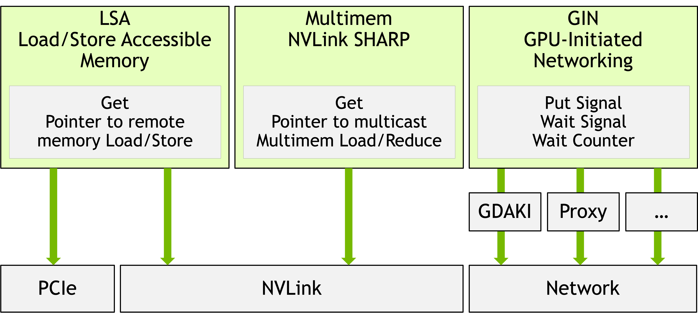
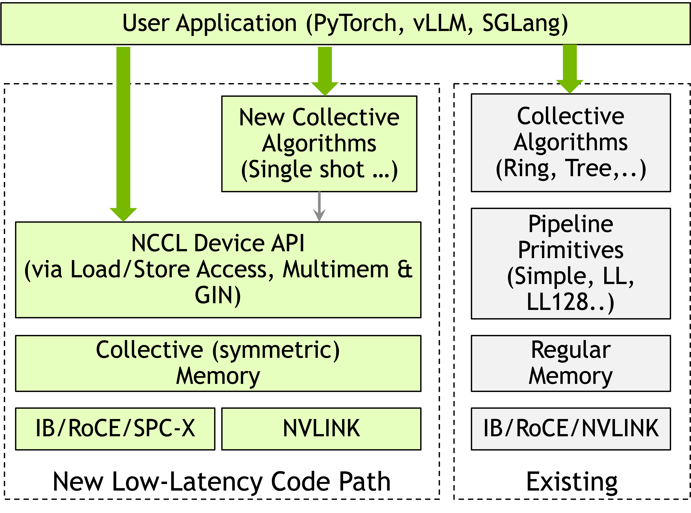
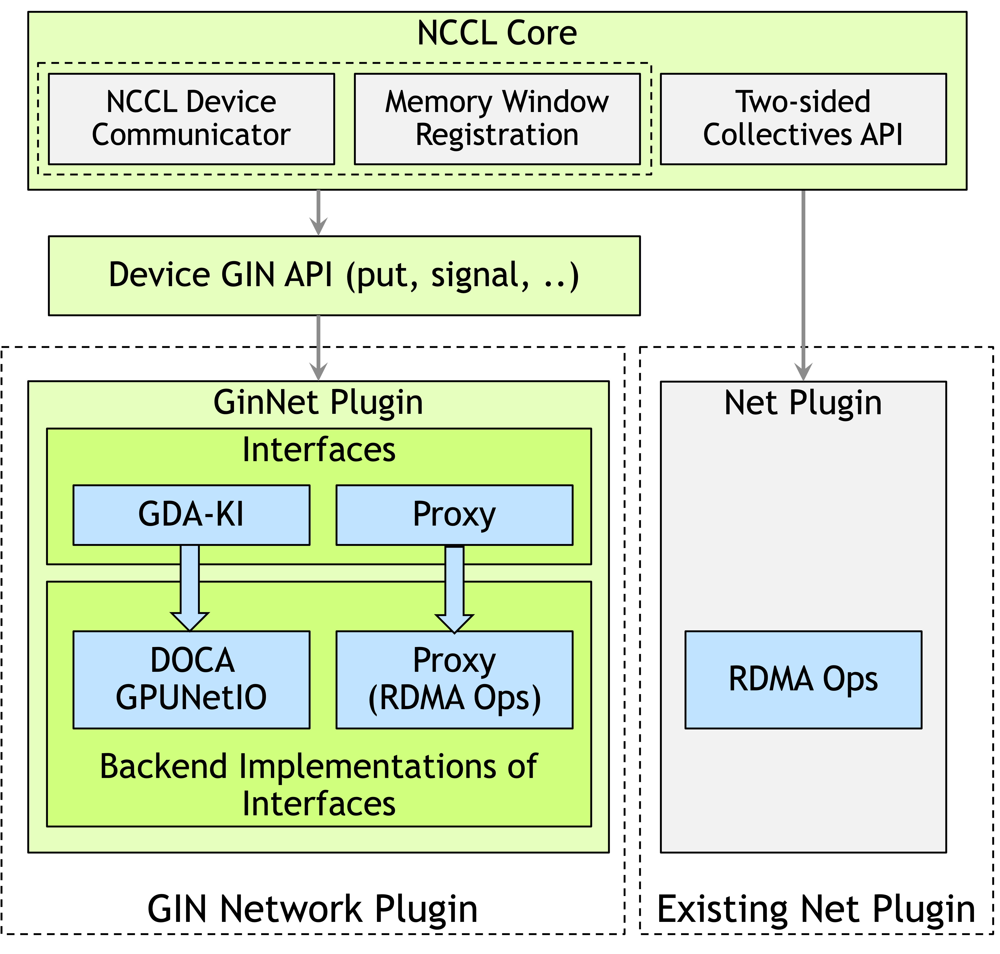
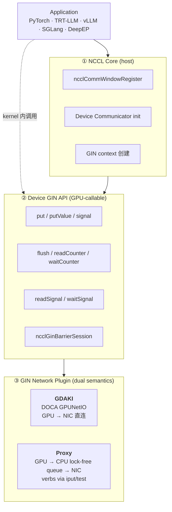

<!-- more -->

# NCCL GIN：把 device-initiated RDMA 带回 NCCL 生态

> arXiv:2511.15076v2 · NVIDIA, 2025
>
> 关键词：NCCL 2.28 Device API · GIN · DOCA GPUNetIO · one-sided RDMA · DeepEP

## TL;DR {: .tldr-heading }

现代 AI 负载（尤其 MoE 推理和编译器生成的 fused kernel）需要从 GPU kernel 内部直接发起细粒度、低延迟的 GPU↔GPU 通信。传统 NCCL 是 host-initiated——CPU 编排每次通信、每次调用都是独立 kernel launch——对大规模集合通信很稳健，但对 MoE 动态 token routing、JAX/Triton 的 comm-compute fusion、推理 decode 的点对点小消息这类场景，CPU 协调和 host-device 同步开销是多余的。

NVSHMEM 的 device-initiated RDMA（IBGDA）证明了低延迟的可能，但它是独立 runtime，和 NCCL 生态脱节：用户要么放弃 NCCL 的 topology-aware 集合和生产级基础设施，要么放弃 device-initiated 的低延迟。

NCCL 2.28 的 **GIN（GPU-Initiated Networking）**把 device-initiated 一边 RDMA 语义纳入 NCCL 统一 runtime，双 backend 设计——**GDAKI**（DOCA GPUNetIO，GPU 直连 NIC）覆盖生产级硬件，**Proxy**（GPU → CPU → NIC）兜底任何 RDMA NIC。在 DeepEP 上的 HT kernel 已经和 NVSHMEM 打平（1–2% 差异），LL kernel 2 节点下 GIN 甚至**比 NVSHMEM 低 9% 延迟**。

自然会问：这是不是意味着 NVSHMEM 以后没必要再单独挂？从 DeepEP 的验证看答案偏向"是"，但还有一些现阶段限制（window 对称大小、每 communicator 4 context）要解决。

## 为什么需要 device-initiated RDMA

传统 NCCL 的模型是 host-initiated：CPU 决定什么时候通信、调用对应 collective kernel、等它完成。这对大规模集合通信（all-reduce、broadcast）是对的——数据大、调用稀、CPU 协调成本能摊薄。

但现代负载和上面的假设越来越不符：

- **MoE 动态 token routing**（DeepSeek-V3 风格）：每 decode step 都有 token-to-expert 的小消息路由，走 host 一次 kernel launch 的延迟占比太大
- **JAX/Triton 的 comm-compute fusion**：compiler 生成的 kernel 想在 kernel 内部完成通信 + 计算
- **推理 decode 阶段的点对点小消息**：频繁、小、紧，CPU 协调纯开销

NVSHMEM 加上 IBGDA 解决了 device-initiated 这件事，但它是独立 runtime，不具备 NCCL 的 topology-aware 集合、容错、弹性扩缩等生产特性。用户要么整个项目用 NVSHMEM、要么想办法两个 runtime 共存。

**GIN 的定位**就是把 device-initiated 一边 RDMA 语义带回 NCCL，保留 NCCL 的生产级基础设施。

## NCCL 2.28 Device API 三模式

Device API 根据底层互联提供三种 device-side 通信：

| 模式 | 硬件 | 典型用途 |
|---|---|---|
| **LSA**（Load/Store Accessible） | NVLink / PCIe（节点内） | 节点内对等 GPU load/store |
| **Multimem** | NVLink SHARP | 硬件 multicast / reduce |
| **GIN** | InfiniBand / RoCE（跨节点） | 跨节点 one-sided RDMA |



图 1-1 NCCL Device API 的三种模式与各自对应的底层互联
{: .figcaption }

和传统 host-initiated NCCL 的关键区别：**Device API 操作的是 collective symmetric memory window**，而传统 NCCL 在 regular memory 上跑 pipeline 原语（Simple / LL / LL128）。



图 1-2 Device API（左）和传统 host-initiated NCCL（右）的对比：前者 kernel 内直接发起、操作 symmetric window；后者 CPU 编排、跑 pipeline 原语
{: .figcaption }

## GIN 三层架构



图 1-3 NCCL GIN 的三层架构：NCCL Core 负责 host 侧资源；Device GIN API 提供 GPU-callable 原语；GinNet Plugin 有 GDAKI 和 Proxy 双后端
{: .figcaption }

对应到调用栈：



图 1-4 GIN 调用栈：应用既可以走 NCCL Core 做初始化，又可以在 kernel 内直接调 Device API
{: .figcaption }

### NCCL Core — host 侧

- `ncclCommWindowRegister`：集合注册 memory window，返回含所有 peer remote key 的 handle
- 资源分配、communicator 初始化、GIN context 创建
- **allocation 与 registration 解耦**：可以从已有 buffer 创建 window
- 当前 NCCL 2.28 要求 window 对称大小，未来会放开（对 disagg 的 prefill/decode 不同 buffer size 尤其重要）

### Device GIN API — GPU kernel 内调用

四类操作：

| 类别 | 操作 | 含义 |
|---|---|---|
| Data movement | `put` / `putValue` / `signal` | 单边写、小值 inline 写、远端通知 |
| Local completion | `flush` / `readCounter` / `waitCounter` | 本地源 buffer 可复用 |
| Remote completion | `readSignal` / `waitSignal` | 远端数据已可见 |
| Barrier / state | `ncclGinBarrierSession` / `reset*` | 跨 rank 同步、重置 |

**Context 是网络并行的核心抽象**。每个 context 封装一条 GPU↔NIC 通道（QP + connection），单 communicator 可以开多个 context，同时利用多 NIC、多 port、多 QP。一个 context 可寻址 communicator 内所有 rank，并发发向不同 peer。

**完成语义**（这一层很容易踩坑）：

- **Counter**：本地、per-op、按用户提供的 `counterID` 计数。适合 pipeline 算法。
- **Signal**：远端、**ID 寻址**（不是 OpenSHMEM 的 address 寻址），硬件实现更高效。
- **Flush ≠ Counter**：flush 只保证 context 内**本地**全部完成（源 buffer 可复用），**不保证远端可见**。

**Ordering 默认 unordered**。只保证同 context 同 peer 的 `put` 与后续 `signal` 之间的顺序。用法是批量 put 后最后一个带 signal，实现 **release-acquire** 语义。线程间顺序用户用 CUDA 原语自己管（`__syncwarp` 等）。

### GIN Network Plugin — 双 backend

| 维度 | GDAKI | Proxy |
|---|---|---|
| 通信路径 | GPU ↔ NIC（直连） | GPU → CPU → NIC |
| CPU 参与 | 无 | 每 communicator 一个 pinned 线程 |
| 发起方式 | GPU 直接写 NIC doorbell | GPU 写 64B descriptor → CPU lock-free queue → CPU 发 verbs |
| 硬件要求 | **ConnectX-6 Dx+、CUDA 12.2+** | 任何 RDMA NIC（IB/RoCE/iWARP），任何 CUDA |
| 设备 API 所有权 | Plugin 提供 device code | NCCL Core 提供 device code，plugin 只实现 `iput`/`iput_signal`/`test`/`regMr` |
| 调试 | 只能 device-side | host-side trace 友好 |
| 典型场景 | 生产 HPC/AI 集群 | 开发、legacy、多厂商 fabric |

运行时通过 capability probe 自动选择，`NCCL_GIN_BACKEND` 可强制覆盖。

## 设备端 API 示例

一个 ring exchange 的简化写法：

```cpp
__global__ void ringExchange(
  ncclDevComm devComm,
  ncclWindow_t sendWin,
  ncclWindow_t recvWin,
  size_t dataSize, int myRank)
{
  ncclGin gin(devComm, /*contextIndex=*/0);
  int peer = (myRank + 1) % devComm.nRanks;

  // put + 顺带把 peer 的 signal[0] 自增 1
  gin.put(ncclTeamWorld(devComm), peer,
          recvWin, myRank * dataSize,
          sendWin, peer * dataSize, dataSize,
          ncclGin_SignalInc{0});

  // 等前驱 rank 的 put 到达
  gin.waitSignal(ncclCoopCta(), 0, 1);
  gin.resetSignal(0);
}
```

几个 API 语义上的关键点：

- **window + offset 寻址**（不是指针）
- `SignalInc` / `SignalAdd` 可附加在 `put` 上，省一次 round-trip
- 协作级别通过 `ncclCoopCta()` / `ncclCoopThread()` / warp 变体选择

## DeepEP 集成：真实负载验证

DeepEP 是 DeepSeek 的 MoE 专用通信库，原生用 NVSHMEM + IBGDA。本文把 GIN 作为后端接入，**与原 NVSHMEM 路径共存**（用户按环境选择）。这是 GIN 第一次在"重度 device-initiated"的真实负载上被检验。

### 集成要求

| 需求 | 数量 / 形式 |
|---|---|
| QP 并行 | HT kernel 需 24 QPs；LL kernel 需 8–16 QPs（= 本地 expert 数） |
| 拓扑 | HT = 对称 rank-to-rank RDMA + NVLink forward；LL = 全互联 all-to-all |
| 同步 | 原子更新 head/tail 指针（circular buffer 流控） |
| 后端共存 | IBGDA 与 GIN 运行时切换 |

### 四个语义翻译挑战

| 挑战 | NVSHMEM/IBGDA | NCCL GIN |
|---|---|---|
| 地址模型 | PGAS 指针 + symmetric heap | window + offset |
| 数据 API | `put_nbi(dst, src, n, pe)` warp-collective | `put(team, peer, dstWin, dstOff, srcWin, srcOff, n)` thread |
| 同步原语 | 远端 memory atomics（`atomic_add`） | signal atomics（`signal(peer, id)` + `readSignal(id)`） |
| 完成模型 | `quiet()` per-QP | `flush()` per-context（可并行完成检查） |
| Barrier | `barrier(team)` 整团 | `ncclGinBarrierSession` 带 session ID，可子集同步 |

### multi-communicator mapping

GIN 每 communicator 只有 4 个 context，DeepEP 要 24 QPs，所以要开多个 communicator 拼：

```
num_comms = ceil(QPs / 4)
comm_id   = qp_id / 4
ctx_id    = qp_id % 4
```

### release-acquire 的优雅实现

用 **zero-byte put + SignalAdd** 模拟。批量 put 后发一个 0 字节 put 带 SignalAdd，利用 GIN "同 context 同 peer put-before-signal 有序" 的保证实现 release-acquire。这是整个集成里最优雅的一笔——用最小开销的操作撬动最强的同步保证。

### HT kernel（大 batch，4096 tokens）

- SM 角色分化：奇数 SM = Sender + NVLink Receiver；偶数 SM = Forwarder（RDMA → NVLink 转发）
- head/tail 各走独立 channel（独立 communicator）避免竞争
- 单线程 `put()` + `__syncwarp()` 复刻 warp-collective 语义
- 协调 SM 负责 `flush` → barrier → reset signals → 元数据交换

### LL kernel（小 batch，1–128 tokens）

- 全互联 RDMA mesh、per-expert signal
- SM 分配：`expert_idx = sm_id * G + warp_group_id`（`G = ceil(N_experts / N_SMs)`）
- **混合 NVLink-RDMA**：先 `nccl_get_p2p_ptr` 判断是否同节点，能走 NVLink 就走
- FP8 量化在 host → RDMA 拷贝阶段内联做
- 每个 destination 发完后，由 counting warp 发 `zero-byte put + SignalAdd` 交付 token 计数

## 实验

环境是 EOS 集群，H100 + 8 × 400 Gbps IB。

### 点对点 microbench

Ping-pong `put + signal`，小消息（4–128 B）round-trip 延迟：

| 实现 | 延迟 (μs) |
|---|---|
| NVSHMEM IBRC | **16.0** |
| NCCL GIN GDAKI | **16.7** |
| NCCL GIN Proxy | 18.0 |
| NVSHMEM IBGDA | 24.3 |

GDAKI 和 NVSHMEM IBRC 同档，优于 NVSHMEM IBGDA。Proxy 尽管走 GPU → CPU queue，仍只比 GDAKI 多 1.3 μs。大消息带宽受限，四者收敛。

### DeepEP HT kernel（FP8/BF16，2/4/8 节点）

| 规模 | 操作 | NCCL GIN RDMA BW | NVSHMEM RDMA BW |
|---|---|---|---|
| 2 nodes (16 GPU, BF16) | dispatch | 84.36 GB/s | 84.97 GB/s |
| 8 nodes (64 GPU) | dispatch | ~53–54 GB/s | ~53–54 GB/s |

全配置下两者差异 **1–2%**。

### DeepEP LL kernel（BF16，hidden=7168，14352 B 消息）

**NVLink enabled**：

- 1 node：GIN dispatch 185.28 GB/s / 40.62 μs；NVSHMEM 182.15 GB/s / 41.43 μs
- 2 nodes：GIN 延迟**比 NVSHMEM 低 9%**（142.51 vs 157.00 μs）
- combine 全规模 1–3% 内

**NVLink disabled（pure RDMA）**：

- 1 node：47.00 GB/s / 160.82 μs（GIN）≈ 46.79 / 160.67（NVSHMEM）
- 8 nodes：34–35 GB/s / 219–225 μs

**结论**：GIN 在 DeepEP 这种重度 device-initiated 负载上，性能已经追平甚至略超 NVSHMEM/IBGDA。

## 相对既有工作

| 既有方案 | 短板 | GIN 如何解决 |
|---|---|---|
| NVSHMEM | 独立 runtime，脱离 NCCL 生态 | 同语义、同能力，直接内建在 NCCL 2.28 |
| GPUrdma / GIO | GPU-NIC memory consistency 难 | 靠 DOCA GPUNetIO 的生产级设备 verbs + ID-based signal |
| GPUDirect Async (2016) | CPU 仍需预构描述符 | GPU 线程完全自主构造 WQE + 写 doorbell |
| DeepEP / pplx-kernels | 独立库，无法复用 NCCL 集合、topology、容错 | GIN 是 NCCL 原生原语，可与集合混用 |
| MSCCL / MSCCL++ | 聚焦 synthesized collective，device-initiated 点对点 RDMA 不是核心 | GIN 专注 device-initiated RDMA + 单边语义 |

## 我的几个判断

**生态统一**。第一次把 device-initiated RDMA 以原生 plugin 形式接入 NCCL，意味着未来 TRT-LLM / vLLM / SGLang / PyTorch 里**不必再挂 NVSHMEM 这第二套 runtime**。对运维面是明显收敛。

**双 backend 是务实设计**。GDAKI 上限高但硬件门槛高（ConnectX-6 Dx+、CUDA 12.2+）；Proxy 兜底任何 RDMA NIC，部署生命周期更长。对大规模异构集群很关键。

**ID-based signal 比 address-based 更简洁**。相比 OpenSHMEM 的 address-based 同步，ID-based 硬件实现更友好，也给 NIC/DPU 设计留了空间。

**release-acquire via zero-byte put + SignalAdd 是会被大量复用的模式**。在未来 MoE / disagg 通信里这个 pattern 会反复出现。

### 现阶段限制（作者自己承认）

- NCCL 2.28 窗口大小要求对称（disagg prefill/decode 异构 buffer 还没法原生表达）
- 每 communicator 4 context 对 DeepEP 这种重度并行还是紧，要多开 communicator 拼
- GDAKI 的 WQE 还没 batch，一次 doorbell 一次操作；roadmap 已列优化
- 评测集中在 DeepEP，暂无 JAX/Triton/PyTorch distributed 的端到端数据

### 对我的工作的几个影响

**AFD / disagg serving**：GIN 的 per-context flush、signal 远端同步非常契合 Attention↔FFN 的 per-layer 紧同步需求，比 NCCL send/recv + host launch 低延迟得多。值得跟进。

**NIXL / KV transfer**：KV cache 跨实例传输天然是 one-sided 写 + 远端完成通知，GIN 直接可用。以后 NIXL 可能复用 GIN 作为 RDMA 后端。

**MoE 推理**：若 DeepEP 未来官方支持 GIN backend，部署依赖从 NVSHMEM 迁移到 NCCL，运维面大幅收敛。

### 有待观察

- GDAKI 的 WQE batching / doorbell amortization 落地后，能否把小消息延迟压到 10 μs 以下
- NCCL Symmetric memory window 放开非对称大小的节奏（disagg 真正需要）
- 非 NVIDIA NIC 厂商（Broadcom / AWS EFA 等）是否会跟 Proxy plugin 语义对接

后续生态进展再更新。

## 相关链接

- [arXiv:2511.15076](https://arxiv.org/abs/2511.15076)
- NCCL 2.28 Device API 官方文档
- DOCA GPUNetIO（GDAKI 底层）
- NVSHMEM / IBGDA 对比基线
- [DeepEP 项目笔记](../../projects/deepep.md)
- MPI RMA window 模型（window 语义借鉴来源）

KB 内：

- [DeepEP 项目笔记](../../projects/deepep.md)
- [DeepSeek-V4 架构](2026-04-24-deepseek-v4.md) / [基础设施](2026-04-24-deepseek-v4-infra.md)
- [通信与网络 →](../../communication/index.md)
