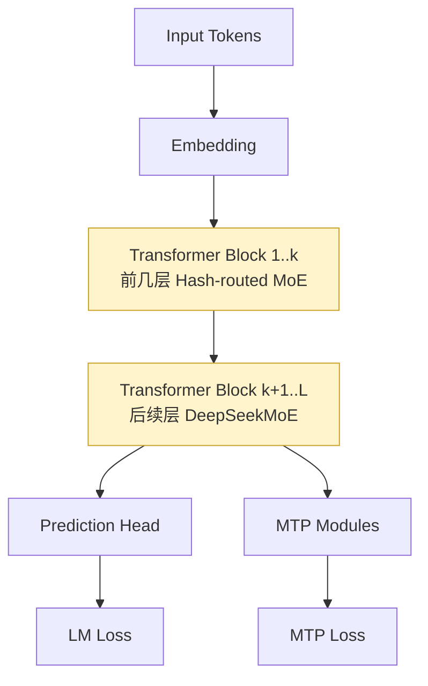
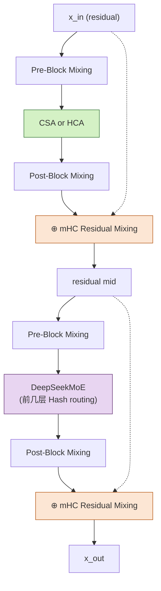
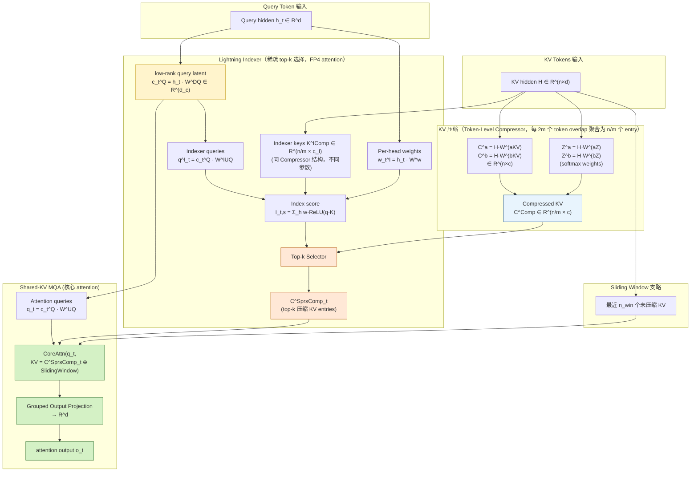
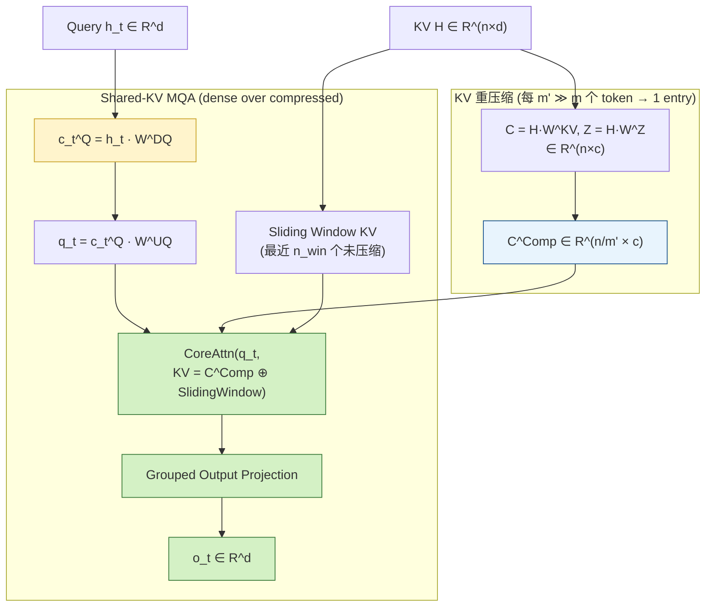

<!-- more -->

# DeepSeek-V4：MLA 彻底不用了？

> By: DeepSeek-AI · 2026-04-24 发布（preview）
>
> Tech Report：[DeepSeek_V4.pdf](https://huggingface.co/deepseek-ai/DeepSeek-V4-Pro/resolve/main/DeepSeek_V4.pdf) · Weights：[deepseek-ai/DeepSeek-V4-Pro](https://huggingface.co/deepseek-ai/DeepSeek-V4-Pro)
>
> 姊妹篇：[DeepSeek-V4 基础设施拆解](2026-04-24-deepseek-v4-infra.md)（Section 3 / 5 / 6）

## TL;DR {: .tldr-heading }

DeepSeek 2026-04-24 放出 V4 家族 preview：V4-Pro 1.6T 总参 / 49B 激活，V4-Flash 284B / 13B，原生支持 1M 上下文。HF 权重、Tech Report、SGLang day-0 PR 同日到位。

V4 最刺眼的结构改动是 attention：**MLA 被完全换掉**。V2 到 V3.2 一路沿用的 Multi-head Latent Attention 在 V4 的 Section 2 里既不在"继承列表"里，也不在任何细节描述里出现。取代它的是 **Hybrid Attention = CSA (Compressed Sparse Attention) + HCA (Heavily Compressed Attention)**，两种按层 interleave。带来的效率提升很夸张：1M 上下文下单 token 推理 FLOPs 仅为 V3.2 的 27%，KV cache 仅为 10%；对比朴素 BF16 GQA8 baseline，KV cache 压到 2%。

自然会问：MLA 真的一点也不要了？CSA / HCA 具体是怎么构造的？对 Hopper / Blackwell 部署到底意味着什么？这篇笔记沿着 Tech Report Section 2 把架构捋一遍；训练和推理的 infra 部分走到姊妹篇。

## DeepSeek-V4 概览

V4 家族首批放出 4 个权重仓库：

| 仓库 | 总参数 | 激活参数 | 上下文 | License |
|---|---|---|---|---|
| DeepSeek-V4-Pro | 1.6T | 49B | 1M 原生 | MIT |
| DeepSeek-V4-Flash | 284B | 13B | 1M 原生 | MIT |
| DeepSeek-V4-Pro-Base | 1.6T | — | 1M 原生 | MIT |
| DeepSeek-V4-Flash-Base | 284B | — | 1M 原生 | MIT |

HF 列表页显示的 862B / 158B / 292B / 1.6T 是 Safetensors 下载体积（FP4/FP8 量化后），不是参数量本身。训练 tokens 分别是 V4-Pro 33T、V4-Flash 32T，约为 V3.2 的两倍。

从 V3 继承的东西很少，Tech Report 明确只列了两件：**Transformer 骨架 + MTP（Multi-Token Prediction）**。MoE 组件是 DeepSeekMoE（有微调）。其它全部是新的。

## 整体结构



图 2-1 DeepSeek-V4 顶层架构：前若干层用 Hash routing 的 MoE，后续层用学习式 DeepSeekMoE；顶部同时挂 LM head 和 MTP head
{: .figcaption }

单个 Transformer Block 内，attention 子层和 FFN 子层各自被一层 mHC 残差混合包住：



图 2-2 单个 Transformer Block：attention / FFN 两个子层各自包一层 mHC 残差
{: .figcaption }

层总数 `L`、前几层用 Hash routing 的数量 `k`、CSA 与 HCA 的层间分配比例，Tech Report Section 2 没给具体数字，需要看 HF 仓库 `inference/` 下的参考实现。

## Hybrid Attention

Section 2 开头一句话把 V4 和 V3 的关系讲清楚了：

> "Compared with the DeepSeek-V3 architecture, DeepSeek-V4 series retain the DeepSeekMoE framework and Multi-Token Prediction (MTP) strategy, while introducing several key innovations in architecture and optimization. ... CSA compresses the KV caches along the sequence dimension and then performs DeepSeek Sparse Attention (DSA), whereas HCA applies more aggressive compression to the KV caches but keeps dense attention."

MLA 不在"retain"里，MoE 微调里也没提到。**MLA 在 V4 彻底退出**。但这并不是"推倒重来"。更准确的描述是：**换了 KV 的压缩轴**。

| 方案 | KV 压缩轴 | Core attention |
|---|---|---|
| MLA（V2 / V3 / V3.2） | latent 维度：KV 压成低秩 latent，attention 时 per-head 展开 | Multi-head |
| V4 CSA | sequence 维度：每 m 个 token 的 KV softmax 加权聚合成 1 个 entry → 过 DSA 选 top-k | **Shared-KV MQA**（所有 head 共享压缩后 KV） |
| V4 HCA | 同 CSA 结构，压缩比 m' ≫ m，**dense attention**（不做稀疏选 top-k） | Shared-KV MQA |

MLA 做的是 latent-dim 压缩 + 多头展开；V4 做的是 sequence-dim 压缩 + shared-head MQA。两件事叠加起来才解释了 10% 的 KV cache 数字。值得一提的是 **DSA 被保留了**，作为 CSA 内部的稀疏选择步骤，而不是被抛弃。

### CSA



图 2-3 CSA 核心数据流：压缩路径 + Lightning Indexer 稀疏选择 + Sliding Window 三路汇入 Shared-KV MQA
{: .figcaption }

CSA 有三条并行路径，最后汇入同一个 core attention：

**KV 压缩路径**。输入 hidden 矩阵 `H ∈ R^(n×d)`。用两组独立可学习投影得到 `C^a, C^b ∈ R^(n×c)` 作为 value、`Z^a, Z^b` 作为 softmax 权重。然后每 `2m` 个 token 的 entries 做 softmax-weighted 聚合成 1 个 compressed entry（相邻块的 `C^b` 和 `C^a` index 有 overlap）：

$$S^a_{m_i:m_{i+1}-1}; S^b_{m_{i-1}:m_i-1} = \text{Softmax}_{\text{row}}([Z^a_{m_i:m_{i+1}-1} + B^a;\ Z^b_{m_{i-1}:m_i-1} + B^b])$$

$$C^{\text{Comp}}_i = \sum S^a_j \odot C^a_j + \sum S^b_j \odot C^b_j$$

序列维度从 `n` 压到 `n/m`。

**Lightning Indexer 路径**。对同样的 `H` 用第二套压缩参数得到 indexer keys `K^{IComp} ∈ R^(n/m × c_I)`。查询侧做一次低秩投影 `c_t^Q = h_t · W^{DQ} ∈ R^{d_c}`（这是 V4 里唯一残留的 MLA 风格 latent 压缩，**只用在 query 侧、只在 indexer 内部**）。从 `c_t^Q` 生成 `n_h^I` 个 indexer queries 和一组 per-head 权重 `w_t^I`。打分公式：

$$I_{t,s} = \sum_{h=1}^{n_h^I} w^I_{t,h} \cdot \text{ReLU}(q^I_{t,h} \cdot K^{IComp}_s)$$

按 `I_{t,·}` 选 top-k compressed entries，作为 `C^{\text{SprsComp}}_t` 交给后面的 core attention。

**Sliding Window 支路**。最近 `n_win` 个 token 保持未压缩，直接并入 core attention 的 KV，保住局部精度。

三路汇入 **Shared-KV MQA**：从同一个 `c_t^Q` 产生 `n_h` 个 query head（`q_t = c_t^Q · W^{UQ}`），和 `C^{\text{SprsComp}}_t ⊕ SlidingWindow` 做 attention。输出走 **Grouped Output Projection** 回到 `R^d`——先把 `n_h` 个 head 切成 `g` 组，每组投到 `d_g < c · n_h / g` 维，最后 concat 投回 hidden size。

整个过程有几处设计值得单独记一下。`c_t^Q` 这个 query latent **同时被 Lightning Indexer 和 Core Attention 两处共享**，少做一次 down-projection。Indexer 的 `K^{IComp}` 和 KV 的 `C^{Comp}` 用的是同样的 compression 操作，但参数独立；**Indexer 的 attention 计算全跑 FP4**，index scores 从 FP32 降到 BF16，top-k 选择器 2× 加速且保持 99.7% recall。Core attention 的 K 和 V 是同一份 `C^{\text{SprsComp}}_t`（MQA 共享），只有 query 多头。

### HCA



图 2-4 HCA 核心数据流：同样的压缩结构，但压缩比更激进、去掉 Lightning Indexer、去掉 top-k，直接 dense attention on compressed KV
{: .figcaption }

HCA 的压缩机制和 CSA 同构，只是 `m' ≫ m`（比如 CSA 压 8 倍、HCA 压 64 倍）——压得更狠。压完之后**不做稀疏选择**，query 直接对全部 compressed entries 做 dense attention。Shared-KV MQA、Sliding Window 支路、Grouped Output Projection 都保留。

### 其他组件

几个没单独画在图里但都在 attention 里同时起作用的小部件：

**Partial RoPE**。只在 `c` 维度的最后 64 维应用 RoPE。由于 KV entries 同时当 key 和 value 用，naïve 实现里 attention output 里会带上"绝对位置"，论文的做法是额外对 output 每一头的最后 64 维也应用位置 `-i` 的 RoPE，这样 output 最终带的是"相对位置"信息。

**Additional Sliding Window Attention**。前面提到了，每个 query 除了 attend top-k compressed entries 外，还 attend 最近 `n_win` 个未压缩 token。目的是保证 causality 严格成立（query 不能看到同 compressed block 内其它 token），也保留近邻依赖。

**Attention Sink**。参考 Xiao et al. 2024，为每个 head 设一组可学习 sink logits `{z'_1, ..., z'_{n_h}}`，加到 softmax 分母里，让 attention scores 可以不归一化到 1（甚至接近 0）。训练更稳。

**Query / KV Entry RMSNorm**。对 query 每个 head、KV entry 唯一那份头，attention 前各做一次 RMSNorm。这一步配合前面的 sink，**替代了 Kimi K2 里的 QK-Clip 技巧**——不需要再单独做。

### Hybrid Attention 小结

效率数字汇总（Tech Report Section 2.3.4）：

| 基线 | V4-Pro | V4-Flash |
|---|---|---|
| BF16 GQA8 (head dim 128) | ~2% of baseline KV cache | ~2% of baseline KV cache |
| DeepSeek-V3.2 | 27% 单 token FLOPs · 10% KV cache | 10% 单 token FLOPs · 7% KV cache |

Indexer 的 attention 跑 FP4；CSA / HCA 的 core attention 用 **BF16 处理 RoPE 维度 + FP8 处理其余维度**的混合存储格式，KV footprint 比纯 BF16 再降一半。

这一套组合拳 + mHC 的稳定性 + Muon 的训练效率，让 V4 series 能原生支持 1M token 上下文 serving——而不是只是"benchmark 能跑"。

## mHC

mHC（Manifold-Constrained Hyper-Connections）是 V4 替代标准残差的结构。来源是梁文锋 2026/1 合作的 arXiv paper（Xie et al., 2026，arXiv 2512.24880）。V4 是它在旗舰模型上的首次大规模落地。

**标准 HC**（Zhu et al. 2025）把 residual stream 的宽度从 `d` 扩到 `n_hc × d`，用三个线性映射 `(A, B, C)` 代替原本的恒等残差。这样每层对 residual 的读写都可以有独立的"通道选择"，理论上模型容量更大。但深层堆叠时训练不稳定——没有约束的 `B` 矩阵一旦奇异值超过 1，forward / backward 都会爆。

**mHC 的做法**是把 `B_l` 约束到**双随机矩阵流形**（Birkhoff polytope）：

$$\mathcal{M} := \{M \in \mathbb{R}^{n \times n} \mid M\mathbf{1}_n = \mathbf{1}_n,\ \mathbf{1}_n^T M = \mathbf{1}_n^T,\ M \geq 0\}$$

落在 `M` 上的矩阵谱范数必然 `≤ 1`，forward / backward 都是"非扩张"的。多层堆叠不会发散。工程实现用 **Sinkhorn-Knopp 迭代**（20 次）投影到流形；输入 / 输出映射 `A, C` 用 Sigmoid 约束到非负有界。三个映射的参数本身被进一步分解成 **dynamic（输入相关） + static（固定 bias）两部分**动态生成。

mHC 在 V4 里带来的额外 wall-time 开销约 6.7%（详见姊妹篇的训练框架优化部分）。

## Muon 优化器

Muon 这次是旗舰 MoE 训练线第一次用上。来源要讲清楚：

**原始版本**由 Keller Jordan 2024 提出（一个 short paper），核心是对矩阵参数用 Newton-Schulz 迭代近似做正交化、然后按 SGD-like 规则更新。

**LLM-scale 版本**是月之暗面（Moonshot / Kimi 团队）Liu et al. 2025 做的（arXiv 2502.16982）：加了 weight decay、Nesterov trick、update 的 RMS rescaling 等工程化改动，让 Muon 能用在 trillion 级训练，Kimi K2 是第一个 production 样本。

**V4 的增量**是自定义的 **Hybrid Newton-Schulz 系数方案**。10 次迭代，分两段：

| 阶段 | 步数 | 系数 (a, b, c) | 作用 |
|---|---|---|---|
| 前段 | 8 | (3.4445, −4.7750, 2.0315) | aggressive，把 singular values 快速拉近 1 |
| 后段 | 2 | (2, −1.5, 0.5) | stabilize，精确锁定到 1 |

V4 里的具体配置：AdamW 保留给 embedding、prediction head、mHC 的 static bias / gating、RMSNorm；**其余所有模块用 Muon**。由于 attention 里 query 和 KV entry 都已经做了 RMSNorm，**不需要 QK-Clip**（Kimi K2 里的那个 trick）。

训练栈迁移上，Megatron-LM / NeMo 如果要复现 V4，要加 Muon 实现——Kimi 团队的开源版本可以作为参考。

## MoE 调整

V4 仍用 DeepSeekMoE（fine-grained routed experts + shared experts 的组合），但对 V3 做了几处调整：

- affinity score 的激活函数从 Sigmoid 换成 **Sqrt(Softplus)**
- 保留 auxiliary-loss-free 负载均衡，加一个轻量 sequence-wise balance loss 防单序列内部极端不平衡
- **移除"每 token 路由目标节点数量上限"**，重新设计并行策略保证训练效率
- **前若干层原来的 dense FFN 替换成用 Hash routing 的 MoE 层**

最后一条单独展开。

### Hash routing

Hash routing 来自 Meta AI 的 Roller et al. 2021，《Hash Layers for Large Sparse Models》。核心思想是用**固定的 hash 函数**代替学习的 router，按 token ID 静态分配专家：

```
token "cat" (id=1234) → hash(1234) → expert 5
token "dog" (id=9876) → hash(9876) → expert 2
token "cat" (id=1234) → hash(1234) → expert 5   # 相同 token 恒去同一 expert
```

和常见路由方式相比：

| 路由方式 | 分配依据 | 路由参数 | 负载均衡 |
|---|---|---|---|
| Top-k gating (Switch / Mixtral) | router 网络对 embedding 打分 | router MLP | 靠 auxiliary loss |
| DeepSeekMoE (V2/V3) auxiliary-loss-free | 学习 + bias 更新做均衡 | router + bias | 无显式 loss |
| Hash routing | hash(token_id) mod N | **无 router** | 好 hash 天然均衡 |

Hash routing 的优点是**完全确定性**、零 router 参数、训练第一步就稳；缺点也明显——静态分配不看 context，相同 token 在不同语境下不会分给不同 expert，特化能力有限。

V4 的策略是**深度方向的路由异构**：

```
Block 1..k :   MoE with Hash routing        ← 静态、per-token-id、轻量
Block k+1..L:  DeepSeekMoE (auxiliary-loss-free)  ← 动态、context-aware
```

直觉上讲得通：前几层本就偏 token-level 特征化，接近 embedding lookup 的延续，context 依赖不强，hash 分配够用；到中后层 token 已携带足够 context，才需要学习式路由做专家特化。这个思路和 attention 层"按层选 CSA 还是 HCA"的异构策略完全一致——V4 对"不同层不同需求"这件事很放得开。

## FP4 + FP8 混合精度训练

V4 的 FP4 不是"推理量化"，是 training-aware 的真 FP4。

| 模型 | 精度 |
|---|---|
| V4-*-Base | FP8 mixed |
| V4-* (Instruct) | **FP4 + FP8 mixed**：MoE expert 参数 + CSA Indexer QK 路径跑 FP4，其余 FP8 |

这是旗舰级 MoE 第一次把 expert 权重降到 FP4 训练 + 存储。SGLang day-0 PR 里的 quantizer 文件叫 `mxfp4_deepseek.py`，**用的是 MXFP4（开放标准），不是 NVFP4**。

一个容易被忽视的关键 trick：**FP4 → FP8 dequantization 是无损的**（Tech Report Section 3.4）。原因是 FP8（E4M3）比 FP4（E2M1）多 2 个 exponent bits，只要 FP4 sub-block（1 × 32 tiles）内的 scale factor 动态范围不超过 FP8 的动态范围，fine-grained scale 信息可以完全被 FP8 吸收。经验证当前训练权重满足这个条件。

这个 trick 对 Hopper 是好消息：V4 的 FP4 权重在 H100/H200 上 dequant 到 FP8 不丢精度，**存储还是 FP4 的空间开销**（memory traffic 省一半），算力走 FP8 Tensor Core。Hopper 代差没有想象中那么大——只在 FP4 原生 compute 密集场景才拉开，memory-bound 场景两代差别很小。

## 训练数据与 Post-training

V4-Pro 33T tokens、V4-Flash 32T tokens，大约是 V3（14.8T）和 V3.2（16–18T）的两倍。

Post-training 从 V3.2 的 "mixed RL" 改成了两阶段范式：

**Specialist Training**：每个目标领域（math、code、agent、instruction-following 等 10+ 个）独立训练 expert，Base 模型先 SFT 再跑 RL（GRPO）。

**On-Policy Distillation (OPD)**：用上述 specialists 作为 teachers，让一个 unified student 在 on-policy 采样的 trajectory 上学 multi-teacher KL：

$$\mathcal{L}_{\text{OPD}}(\theta) = \sum_{i=1}^{N} w_i \cdot D_{\text{KL}}(\pi_\theta \| \pi_{E_i})$$

用的是 **full-vocabulary logit distillation**（不是 token-level KL 估计），variance 低、更稳。10+ teachers → 1 unified student。

Post-training 的工程基础设施（teacher scheduling、preemptible rollout、DSec sandbox）全部放在姊妹篇。

## V3.2 → V4 对比

| 项目 | V3.2 | V4-Pro |
|---|---|---|
| 总参 | 671B | 1.6T |
| 激活 | 37B | 49B |
| 上下文 | 128K (可扩 1M) | 1M 原生 |
| KV 压缩轴 | latent 维（MLA） | sequence 维（CSA / HCA） |
| Core attention | Multi-head (MLA) | Shared-KV MQA |
| 稀疏选择 | DSA | DSA（保留，嵌入 CSA 内） |
| 残差 | 标准 | mHC |
| 优化器 | AdamW 变体 | Muon（+ AdamW for embed / norm） |
| 训练精度 | FP8 mixed | FP4 + FP8 mixed |
| 训练 tokens | ~16–18T | Pro 33T · Flash 32T |
| KV cache @ 1M (vs V3.2) | 基线 | 10% (Pro) · 7% (Flash) |
| 推理 FLOPs @ 1M (vs V3.2) | 基线 | 27% (Pro) · 10% (Flash) |
| MTP | 保留 | 保留 |
| MoE 框架 | DeepSeekMoE | DeepSeekMoE + 前几层 Hash routing |

## Benchmark

核心是 Tech Report Table 6 / Table 7 两张表。完整的 benchmark setup、MRCR 长上下文曲线、Terminal Bench、white-collar / Chinese writing 真实任务评测在姊妹篇。这里只给两组对比。

**Base 模型 (DeepSeek-V4-Pro-Base)**

| 类别 | Benchmark | V4-Pro-Base |
|---|---|---|
| 世界知识 | MMLU (5-shot) | 90.1 |
| | MMLU-Pro (5-shot) | 73.5 |
| | C-Eval (5-shot) | 93.1 |
| 代码 & 数学 | HumanEval (0-shot) | 76.8 |
| | GSM8K (8-shot) | 92.6 |
| | MATH (4-shot) | 64.5 |
| 长上下文 | LongBench-V2 | 51.5 |

**Instruct 模型 V4-Pro Max vs Frontier**

| Benchmark | Opus-4.6 Max | GPT-5.4 xHigh | Gemini-3.1-Pro High | DS-V4-Pro Max |
|---|---|---|---|---|
| MMLU-Pro | 89.1 | 87.5 | **91.0** | 87.5 |
| SimpleQA-Verified | 46.2 | 45.3 | **75.6** | 57.9 |
| GPQA Diamond | 91.3 | 93.0 | **94.3** | 90.1 |
| HLE | 40.0 | 39.8 | **44.4** | 37.7 |
| LiveCodeBench | 88.8 | — | 91.7 | **93.5** |
| Codeforces | — | 3168 | 3052 | **3206** |
| SWE Verified | **80.8** | — | 80.6 | 80.6 |
| MRCR 1M | **92.9** | — | 76.3 | 83.5 |

Codeforces 3206 / LiveCodeBench 93.5 是开源第一；SWE Verified 80.6 和 Opus-4.6 Max 并列 SOTA。但 MMLU-Pro / GPQA / HLE 几项世界知识输 Gemini-3.1-Pro 一截，SimpleQA 差距最大。Tech Report 自己对此的总结很坦诚："trails state-of-the-art frontier models by approximately 3 to 6 months"。

## 部署视角的几个快速判断

写给做 inference infra 的人看的几条早期结论，随着社区实测和 TRT-LLM / vLLM 的 day-0 PR 会继续修正：

- **KV cache 10%** 是对长上下文服务经济性的分水岭。在做 PD 分离 / KV mover 带宽预算的队伍，应该重跑一遍 trade-off 曲线——V3.2 时代的一些边际优化在 V4 下可能变成决定性的，反过来也有。
- **Hopper 和 Blackwell 的代差没有想象中大**。FP4 → FP8 无损 dequant 让 H100 / H200 在 memory-bound 场景下吃到 V4 的大部分收益，只有 FP4 原生 compute 密集场景 B200 才真拉开。
- **SGLang day-0 支持很完整**。[sgl-project/sglang#23600](https://github.com/sgl-project/sglang/pull/23600) 2026-04-24 同日开 PR，包含 CSA / HCA 的 CUDA kernel、MXFP4 quantizer、MTP nextN 头、NPU 路径。文件清单里 `deepseek_v4_backend_radix.py` 的命名说明走的是 RadixAttention 变种而不是 PagedAttention——原因在姊妹篇。
- **Huawei Ascend 950PR 独享早期硬件通路**（Reuters 4/3 报道）。SGLang PR 里带 `npu` 标签印证了这一点——day-0 优化可能是 Ascend 先到，NV 侧靠开源社区回补。

## 还没覆盖的

Tech Report Section 3（General Infrastructures）和 Section 5.2（RL / OPD Infra）的全部内容，Section 6 的 conclusion，都在 [DeepSeek-V4 基础设施拆解](2026-04-24-deepseek-v4-infra.md)。

Section 4（Pre-Training：data construction、pre-training setup、mitigating instability）两篇都还没读进来。训练数据细节和稳定性救治的具体 recipe（包括 Tech Report 里承认"原理未明"的 Anticipatory Routing 和 SwiGLU Clamping）是下一步要补的。

## 相关链接

一手：

- [Tech Report PDF](https://huggingface.co/deepseek-ai/DeepSeek-V4-Pro/resolve/main/DeepSeek_V4.pdf) —— DeepSeek-V4: Towards Highly Efficient Million-Token Context Intelligence
- HF model cards：[V4-Pro](https://huggingface.co/deepseek-ai/DeepSeek-V4-Pro) · [V4-Flash](https://huggingface.co/deepseek-ai/DeepSeek-V4-Flash) · [V4-Pro-Base](https://huggingface.co/deepseek-ai/DeepSeek-V4-Pro-Base) · [V4-Flash-Base](https://huggingface.co/deepseek-ai/DeepSeek-V4-Flash-Base)
- 参考推理实现：[`DeepSeek-V4-Pro/tree/main/inference`](https://huggingface.co/deepseek-ai/DeepSeek-V4-Pro/tree/main/inference)

相关工作：

- [Muon is scalable for LLM training](https://arxiv.org/abs/2502.16982) (Liu et al., Kimi team 2025)
- [mHC paper](https://arxiv.org/abs/2512.24880) (Xie et al., 2026)
- [On-Policy Distillation](https://thinkingmachines.ai/blog/on-policy-distillation) (Lu & TM Lab, 2025)
- [Hash Layers for Large Sparse Models](https://proceedings.neurips.cc/paper/2021/hash/92bf5e6240737e0326ea59846a83e076-Abstract.html) (Roller et al., NeurIPS 2021)
- [DeepSeek-V3.2 Tech Report](https://arxiv.org/abs/2512.02556) —— 对照版本

SGLang day-0：[sgl-project/sglang#23600](https://github.com/sgl-project/sglang/pull/23600)

KB 内：

- 姊妹篇：[DeepSeek-V4 基础设施拆解](2026-04-24-deepseek-v4-infra.md)
- [DeepEP 项目笔记](../../projects/deepep.md)
- [NCCL GIN](2026-04-23-nccl-gin.md)
- [AFD Challenges](2026-04-20-afd-challenges.md)
