# AIConfigurator (AIC) 框架系统性文档

> 基于 [ai-dynamo/aiconfigurator](https://github.com/ai-dynamo/aiconfigurator) 代码库分析  
> 论文: [AIConfigurator: Lightning-Fast Configuration Optimization for Multi-Framework LLM Serving](https://arxiv.org/abs/2601.06288)

---

## 1. 定位与核心问题

### 1.1 解决什么问题

在分离式推理部署（Disaggregated Serving）中，配置空间极其复杂：

- Prefill / Decode worker 数量及比例
- 每个 worker 的并行策略：TP × PP × DP × MoE-TP × MoE-EP
- Batch size、KV Cache 分配、量化模式
- 在 TTFT / TPOT SLA 约束下最大化吞吐

**经验搜索成本极高**——优化 72B 模型在 16 GPU 上的配置需约 18,000 GPU-hours（>$93K）。

### 1.2 AIC 做什么

**给定**：模型（HuggingFace ID）+ GPU 数量 + GPU 型号 → **输出**：最优部署配置 + Dynamo 部署文件（K8s YAML, run.sh, CLI args）

核心方法：
1. 将 LLM 推理**分解为原子操作**（GEMM, Attention, MoE, AllReduce, ...）
2. 基于目标硬件的**实测性能数据库**进行插值/外推
3. **搜索数千种配置组合**，筛选 Pareto 最优解
4. **生成可直接部署的配置文件**

### 1.3 支持矩阵

| 维度 | 支持范围 |
|------|----------|
| **GPU** | H100 SXM, H200 SXM, B200 SXM, GB200, A100 SXM, L40S |
| **推理框架** | TensorRT-LLM, vLLM, SGLang |
| **模型架构** | GPT, LLaMA, Qwen, DeepSeek-V3/V3.2, Mixtral, Nemotron, Mamba2, Qwen3.5 (GDN) |
| **并行模式** | TP, PP, DP, EP, Attention-DP |
| **服务模式** | Aggregated (单体), Disaggregated (PD 分离) |
| **量化** | FP16, BF16, FP8, FP8-Block, INT8, INT4 WO, NVFP4, SQ |

---

## 2. 整体架构

### 2.1 三层架构总览

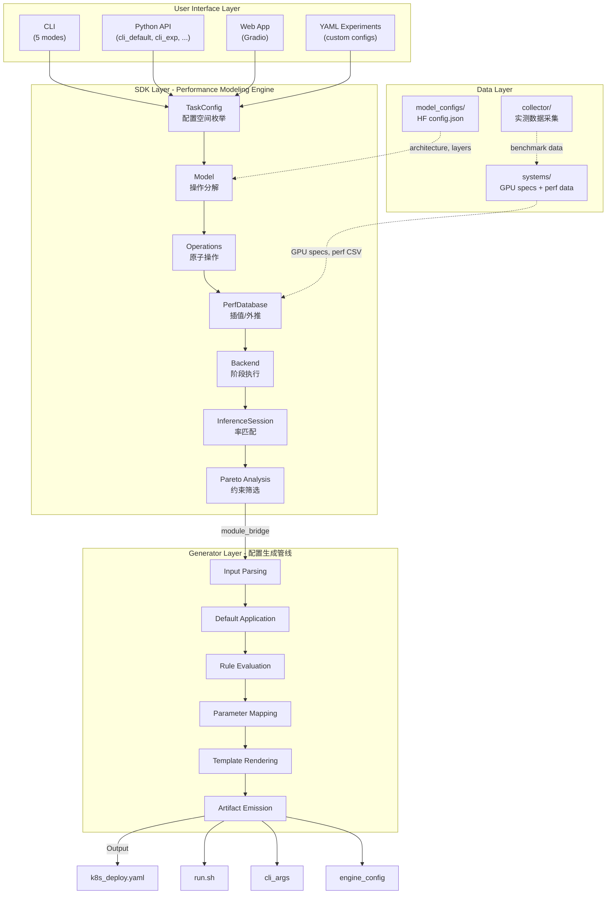
```mermaid
graph TB
    subgraph UI["User Interface Layer"]
        CLI["CLI<br/>(5 modes)"]
        API["Python API<br/>(cli_default, cli_exp, ...)"]
        WEBAPP["Web App<br/>(Gradio)"]
        YAML["YAML Experiments<br/>(custom configs)"]
    end

    subgraph SDK["SDK Layer - Performance Modeling Engine"]
        TC["TaskConfig<br/>配置空间枚举"]
        MODEL["Model<br/>操作分解"]
        OPS["Operations<br/>原子操作"]
        BACKEND["Backend<br/>阶段执行"]
        DB["PerfDatabase<br/>插值/外推"]
        SESSION["InferenceSession<br/>率匹配"]
        PARETO["Pareto Analysis<br/>约束筛选"]
    end

    subgraph GEN["Generator Layer - 配置生成管线"]
        INPUT["Input Parsing"]
        DEFAULTS["Default Application"]
        RULES["Rule Evaluation"]
        MAPPING["Parameter Mapping"]
        TEMPLATE["Template Rendering"]
        ARTIFACTS["Artifact Emission"]
    end

    subgraph DATA["Data Layer"]
        SYS["systems/<br/>GPU specs + perf data"]
        MCFG["model_configs/<br/>HF config.json"]
        COLL["collector/<br/>实测数据采集"]
    end

    CLI & API & WEBAPP & YAML --> TC
    TC --> MODEL --> OPS
    OPS --> DB
    DB --> BACKEND --> SESSION --> PARETO
    PARETO -->|"module_bridge"| INPUT
    INPUT --> DEFAULTS --> RULES --> MAPPING --> TEMPLATE --> ARTIFACTS

    SYS -.->|"GPU specs, perf CSV"| DB
    MCFG -.->|"architecture, layers"| MODEL
    COLL -.->|"benchmark data"| SYS

    ARTIFACTS -->|"Output"| K8S["k8s_deploy.yaml"]
    ARTIFACTS --> RUNSH["run.sh"]
    ARTIFACTS --> CLIARGS["cli_args"]
    ARTIFACTS --> ENGINE["engine_config"]
```

### 2.2 源码模块依赖图

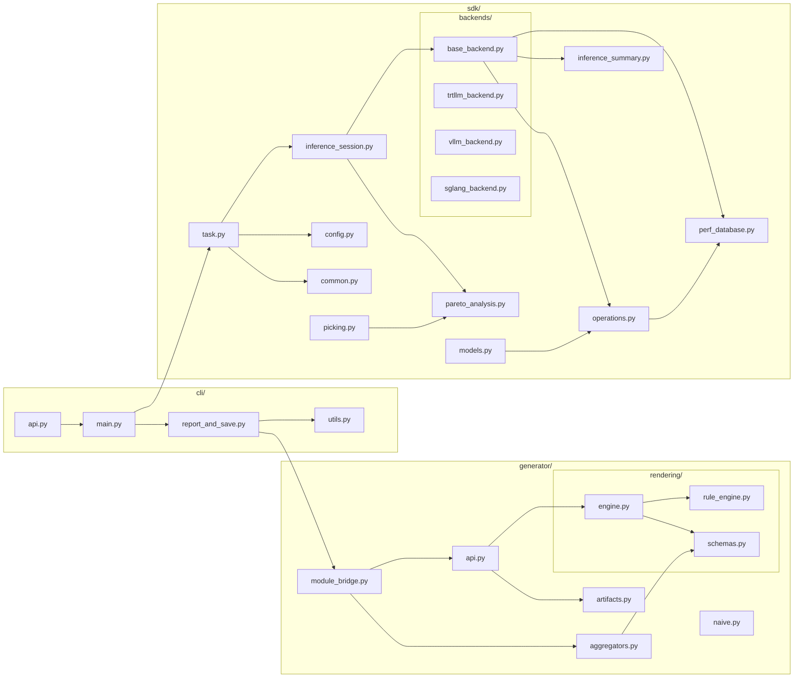
```mermaid
graph LR
    subgraph cli["cli/"]
        cli_main["main.py"]
        cli_api["api.py"]
        cli_report["report_and_save.py"]
        cli_utils["utils.py"]
    end

    subgraph sdk["sdk/"]
        task["task.py"]
        models["models.py"]
        ops["operations.py"]
        session["inference_session.py"]
        summary["inference_summary.py"]
        perfdb["perf_database.py"]
        config["config.py"]
        common["common.py"]
        pareto["pareto_analysis.py"]
        picking["picking.py"]
        subgraph backends["backends/"]
            base["base_backend.py"]
            trtllm_be["trtllm_backend.py"]
            vllm_be["vllm_backend.py"]
            sglang_be["sglang_backend.py"]
        end
    end

    subgraph gen["generator/"]
        gen_api["api.py"]
        agg["aggregators.py"]
        bridge["module_bridge.py"]
        naive["naive.py"]
        subgraph rendering["rendering/"]
            engine["engine.py"]
            rule_eng["rule_engine.py"]
            schemas["schemas.py"]
        end
        artifacts_py["artifacts.py"]
    end

    cli_main --> task
    cli_main --> cli_report
    cli_api --> cli_main
    cli_report --> cli_utils
    cli_report --> bridge

    task --> session
    task --> config
    task --> common
    session --> base
    session --> pareto
    base --> ops
    base --> perfdb
    base --> summary
    ops --> perfdb
    models --> ops
    picking --> pareto

    bridge --> agg
    bridge --> gen_api
    gen_api --> engine
    engine --> rule_eng
    engine --> schemas
    gen_api --> artifacts_py
    agg --> schemas
```

---

## 3. SDK Core：性能建模引擎

SDK 是 AIC 的核心计算引擎，负责将「模型 × 硬件 × 配置」三元组映射为延迟/吞吐预估值。

### 3.1 分层配置系统 (`task.py`)

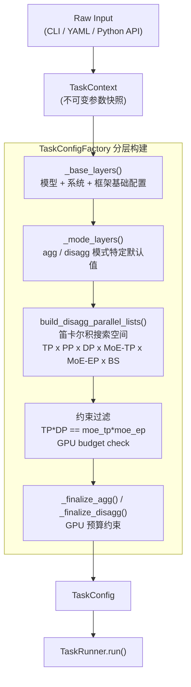
```mermaid
flowchart TD
    INPUT["Raw Input<br/>(CLI / YAML / Python API)"]
    CTX["TaskContext<br/>(不可变参数快照)"]
    
    subgraph FACTORY["TaskConfigFactory 分层构建"]
        BASE["_base_layers()<br/>模型 + 系统 + 框架基础配置"]
        MODE["_mode_layers()<br/>agg / disagg 模式特定默认值"]
        PARALLEL["build_disagg_parallel_lists()<br/>笛卡尔积搜索空间<br/>TP x PP x DP x MoE-TP x MoE-EP x BS"]
        FILTER["约束过滤<br/>TP*DP == moe_tp*moe_ep<br/>GPU budget check"]
        FINAL["_finalize_agg() / _finalize_disagg()<br/>GPU 预算约束"]
    end

    TC["TaskConfig"]
    RUNNER["TaskRunner.run()"]

    INPUT --> CTX --> BASE --> MODE --> PARALLEL --> FILTER --> FINAL --> TC --> RUNNER
```

**搜索空间枚举约束**：
- `TP * DP == moe_tp * moe_ep`（MoE 模型的 Attention DP 与 Expert 并行匹配）
- `TP * PP * DP ∈ valid_gpu_counts`（不超过 GPU 预算）
- 每个框架有独立的合法并行组合（如 SGLang 不支持某些 MoE TP/EP 组合）

### 3.2 操作分解模型 (`operations.py`)

LLM 推理被分解为 **20+ 原子操作**，每个操作知道如何查询性能数据库：

| 操作类别 | 具体操作 | 说明 |
|----------|----------|------|
| **计算** | `GEMM`, `MoE`, `MoEDispatch` | 矩阵乘、MoE 路由+计算 |
| **注意力** | `ContextAttention`, `GenerationAttention` | Prefill / Decode 的标准 Attention |
| | `ContextMLA`, `GenerationMLA`, `MLABmm` | DeepSeek MLA 变体 |
| | `ContextDSAModule`, `GenerationDSAModule` | DeepSeek V3.2 稀疏注意力 |
| **通信** | `CustomAllReduce`, `NCCL`, `P2P` | AllReduce, AllGather, All2All, P2P |
| **MoE 并行** | `TrtLLMWideEPMoE`, `WideEPMoEDispatch` | TRT-LLM WideEP Expert 并行 |
| **非标准** | `Mamba2`, `Mamba2Kernel` | Mamba2 SSM 状态空间模型 |
| | `GDNKernel` | Qwen3.5 GatedDeltaNet (线性注意力) |
| **辅助** | `Embedding`, `ElementWise` | 嵌入层、逐元素操作 |
| **组合** | `OverlapOp` | 建模两组操作的并行执行 (如 shared + routed MoE) |

**每个操作的核心接口**：
```python
class Operation(ABC):
    def query(self, database, **kwargs) -> PerformanceResult:
        """查询性能数据库，返回延迟(ms) + 能耗(W·ms)"""
    def get_weights(self, **kwargs) -> dict:
        """返回缩放因子（如 MTP nextn 缩放）"""
```

### 3.3 模型层 (`models.py`)

将架构名称映射为具体操作序列。每个模型定义 `context_ops[]`（Prefill 阶段）和 `generation_ops[]`（Decode 阶段）：

| 模型类 | 架构 | 操作序列特点 |
|--------|------|-------------|
| `LLAMAModel` | LLaMA 2/3 | 标准: GEMM(QKV) → Attn → GEMM(O) → GEMM(gate_up) → GEMM(down) |
| `MOEModel` | Mixtral | 在 FFN 处替换为: Router → Dispatch → MoE → PostDispatch |
| `DeepSeekModel` | V3/V1.5 | MLA 注意力 + OverlapOp(shared MoE, routed MoE 并行) |
| `DeepSeekV32Model` | V3.2/GLM-5 | DSA 稀疏注意力 + shared/routed MoE overlap |
| `GPTModel` | GPT-OSS | 稀疏注意力 + power-law expert 路由 |
| `NemotronHModel` | Nemotron-H | 混合: Mamba2 + MoE + Transformer |
| `Qwen35Model` | Qwen3.5 | GDN 线性注意力 + 可选 MoE |

**关键计算**：对于 MTP（Multi-Token Prediction），使用 `calc_expectation()` 计算有效 token 数缩放因子。

#### 操作序列对比图

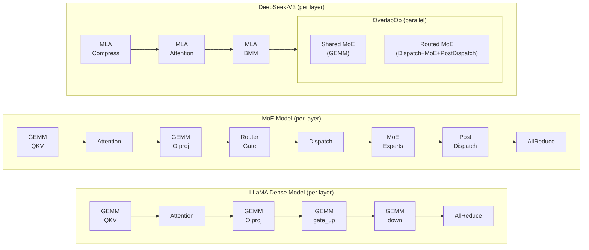
```mermaid
graph LR
    subgraph LLAMA["LLaMA Dense Model (per layer)"]
        direction LR
        L1["GEMM<br/>QKV"] --> L2["Attention"] --> L3["GEMM<br/>O proj"] --> L4["GEMM<br/>gate_up"] --> L5["GEMM<br/>down"] --> L6["AllReduce"]
    end

    subgraph MOE["MoE Model (per layer)"]
        direction LR
        M1["GEMM<br/>QKV"] --> M2["Attention"] --> M3["GEMM<br/>O proj"] --> M4["Router<br/>Gate"] --> M5["Dispatch"] --> M6["MoE<br/>Experts"] --> M7["Post<br/>Dispatch"] --> M8["AllReduce"]
    end

    subgraph DSV3["DeepSeek-V3 (per layer)"]
        direction LR
        D1["MLA<br/>Compress"] --> D2["MLA<br/>Attention"] --> D3["MLA<br/>BMM"]
        D3 --> D4["OverlapOp"]
        subgraph D4["OverlapOp (parallel)"]
            D4A["Shared MoE<br/>(GEMM)"]
            D4B["Routed MoE<br/>(Dispatch+MoE+PostDispatch)"]
        end
    end
```

#### 操作类层级

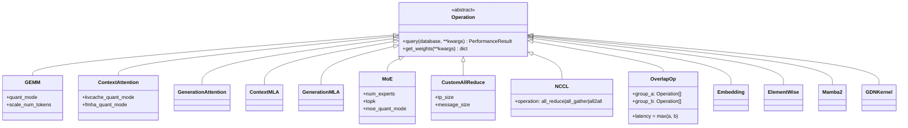
```mermaid
classDiagram
    class Operation {
        <<abstract>>
        +query(database, **kwargs) PerformanceResult
        +get_weights(**kwargs) dict
    }
    class GEMM {
        +quant_mode
        +scale_num_tokens
    }
    class ContextAttention {
        +kvcache_quant_mode
        +fmha_quant_mode
    }
    class GenerationAttention
    class ContextMLA
    class GenerationMLA
    class MoE {
        +num_experts
        +topk
        +moe_quant_mode
    }
    class CustomAllReduce {
        +tp_size
        +message_size
    }
    class NCCL {
        +operation: all_reduce|all_gather|all2all
    }
    class OverlapOp {
        +group_a: Operation[]
        +group_b: Operation[]
        +latency = max(a, b)
    }
    class Embedding
    class ElementWise
    class Mamba2
    class GDNKernel

    Operation <|-- GEMM
    Operation <|-- ContextAttention
    Operation <|-- GenerationAttention
    Operation <|-- ContextMLA
    Operation <|-- GenerationMLA
    Operation <|-- MoE
    Operation <|-- CustomAllReduce
    Operation <|-- NCCL
    Operation <|-- OverlapOp
    Operation <|-- Embedding
    Operation <|-- ElementWise
    Operation <|-- Mamba2
    Operation <|-- GDNKernel
```

### 3.4 性能数据库 (`perf_database.py`)

**核心职责**：管理实测性能数据，对任意参数组合进行插值/外推。

**数据库模式**：

| 模式 | 说明 | 适用场景 |
|------|------|----------|
| `SILICON` | 仅 Roofline 理论模型 | 默认模式，可复现 |
| `HYBRID` | 理论 + 实测数据混合 | 有实测数据时更准确 |
| `EMPIRICAL` | 仅实测数据插值 | 研究用途 |
| `SOL` | Speed-of-Light（含系统限制） | 理论上限分析 |

**50+ 查询方法**，覆盖所有操作类型：
```python
query_gemm(m, n, k, quant_mode)           # GEMM 延迟
query_context_attention(num_tokens, ...)   # Prefill Attention
query_generation_attention(num_tokens, ...)# Decode Attention
query_moe(num_tokens, hidden_size, ...)    # MoE 计算
query_nccl(dtype, num_gpus, op, msg_size)  # NCCL 集合通信
query_p2p(message_bytes)                   # 点对点通信
# ... 等等
```

**插值策略**：2D/3D 线性插值 + 超出范围时的外推（nearest / linear），确保未实测参数组合也能返回合理估计。

#### 数据库查询流程

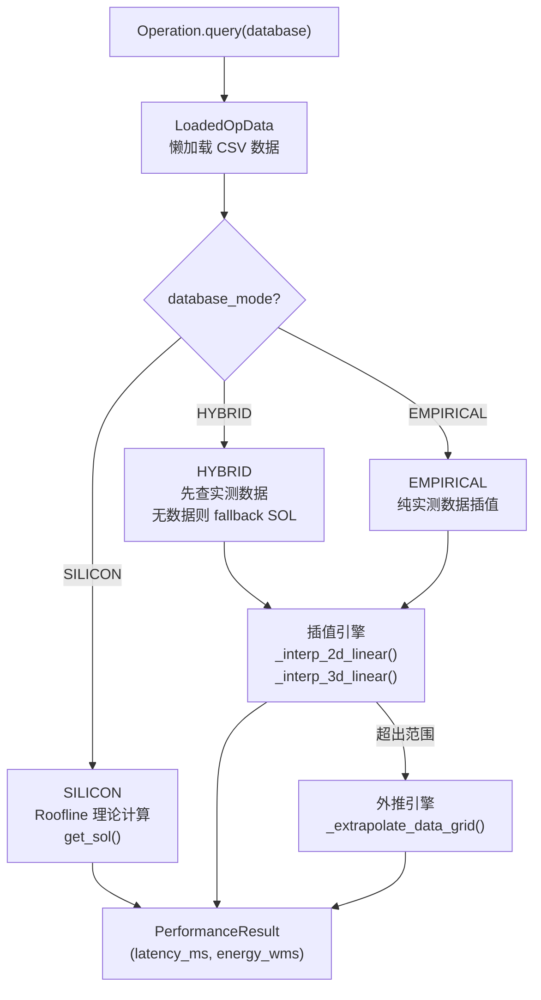
```mermaid
flowchart TD
    OP["Operation.query(database)"]
    LOAD["LoadedOpData<br/>懒加载 CSV 数据"]
    MODE{"database_mode?"}
    
    SOL["SILICON<br/>Roofline 理论计算<br/>get_sol()"]
    HYB["HYBRID<br/>先查实测数据<br/>无数据则 fallback SOL"]
    EMP["EMPIRICAL<br/>纯实测数据插值"]
    
    INTERP["插值引擎<br/>_interp_2d_linear()<br/>_interp_3d_linear()"]
    EXTRAP["外推引擎<br/>_extrapolate_data_grid()"]
    
    RESULT["PerformanceResult<br/>(latency_ms, energy_wms)"]

    OP --> LOAD --> MODE
    MODE -->|SILICON| SOL --> RESULT
    MODE -->|HYBRID| HYB --> INTERP --> RESULT
    MODE -->|EMPIRICAL| EMP --> INTERP
    INTERP -->|"超出范围"| EXTRAP --> RESULT
```

### 3.5 后端抽象 (`base_backend.py`)

基类实现**分阶段执行**逻辑（Context → Generation），子类（TRT-LLM, vLLM, SGLang）实现框架特定行为。

#### 后端执行时序图

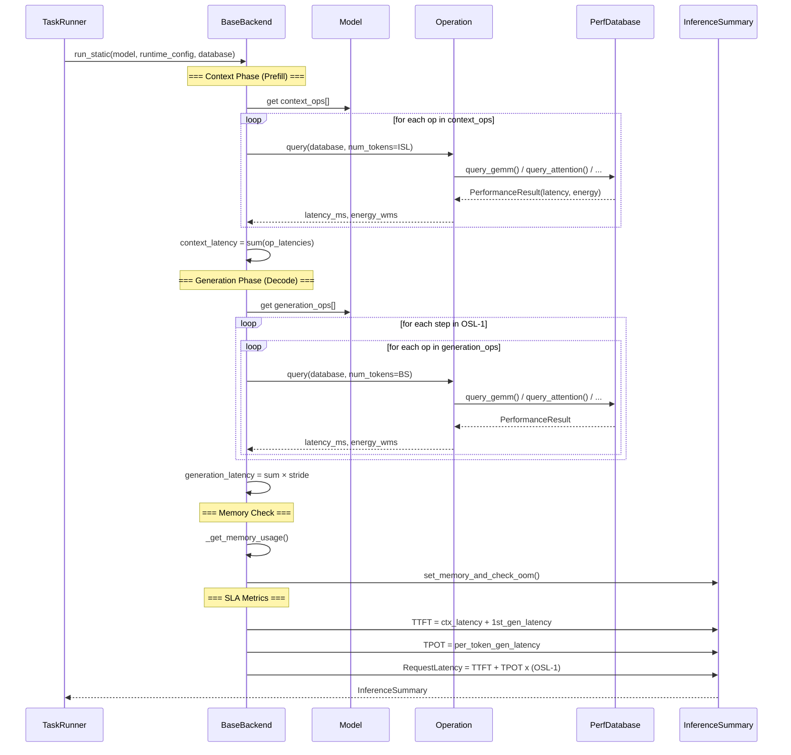
```mermaid
sequenceDiagram
    participant Runner as TaskRunner
    participant Backend as BaseBackend
    participant Model as Model
    participant Op as Operation
    participant DB as PerfDatabase
    participant Summary as InferenceSummary

    Runner->>Backend: run_static(model, runtime_config, database)
    
    Note over Backend: === Context Phase (Prefill) ===
    Backend->>Model: get context_ops[]
    loop for each op in context_ops
        Backend->>Op: query(database, num_tokens=ISL)
        Op->>DB: query_gemm() / query_attention() / ...
        DB-->>Op: PerformanceResult(latency, energy)
        Op-->>Backend: latency_ms, energy_wms
    end
    Backend->>Backend: context_latency = sum(op_latencies)
    
    Note over Backend: === Generation Phase (Decode) ===
    Backend->>Model: get generation_ops[]
    loop for each step in OSL-1
        loop for each op in generation_ops
            Backend->>Op: query(database, num_tokens=BS)
            Op->>DB: query_gemm() / query_attention() / ...
            DB-->>Op: PerformanceResult
            Op-->>Backend: latency_ms, energy_wms
        end
    end
    Backend->>Backend: generation_latency = sum × stride

    Note over Backend: === Memory Check ===
    Backend->>Backend: _get_memory_usage()
    Backend->>Summary: set_memory_and_check_oom()
    
    Note over Backend: === SLA Metrics ===
    Backend->>Summary: TTFT = ctx_latency + 1st_gen_latency
    Backend->>Summary: TPOT = per_token_gen_latency
    Backend->>Summary: RequestLatency = TTFT + TPOT x (OSL-1)
    
    Summary-->>Runner: InferenceSummary
```

**内存建模**：每个后端实现 `_get_memory_usage()`，计算模型权重 + KV Cache + NCCL buffer + 其他开销，OOM 判定直接排除不可行配置。

#### 后端类层级

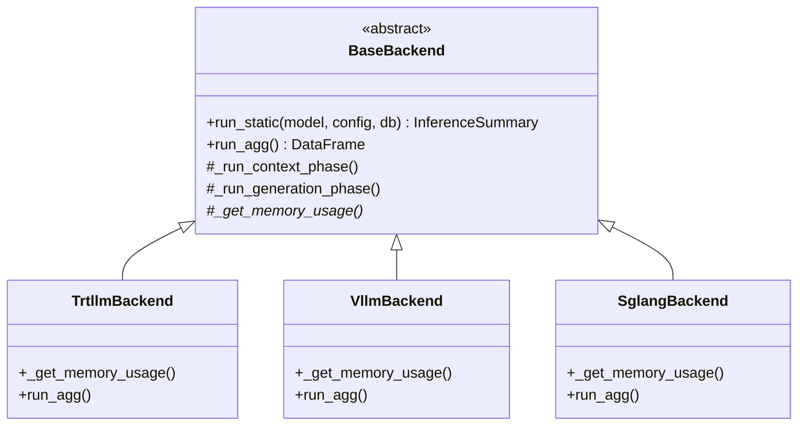
```mermaid
classDiagram
    class BaseBackend {
        <<abstract>>
        +run_static(model, config, db) InferenceSummary
        +run_agg() DataFrame
        #_run_context_phase()
        #_run_generation_phase()
        #_get_memory_usage()*
    }
    class TrtllmBackend {
        +_get_memory_usage()
        +run_agg()
    }
    class VllmBackend {
        +_get_memory_usage()
        +run_agg()
    }
    class SglangBackend {
        +_get_memory_usage()
        +run_agg()
    }
    BaseBackend <|-- TrtllmBackend
    BaseBackend <|-- VllmBackend
    BaseBackend <|-- SglangBackend
```

### 3.6 推理会话与率匹配 (`inference_session.py`)

**Aggregated 模式**：单 worker 扫描 TP/PP/DP × BS 空间，筛选非 OOM 配置。

**Disaggregated 模式**（PD 分离）：

#### Disagg 率匹配时序图

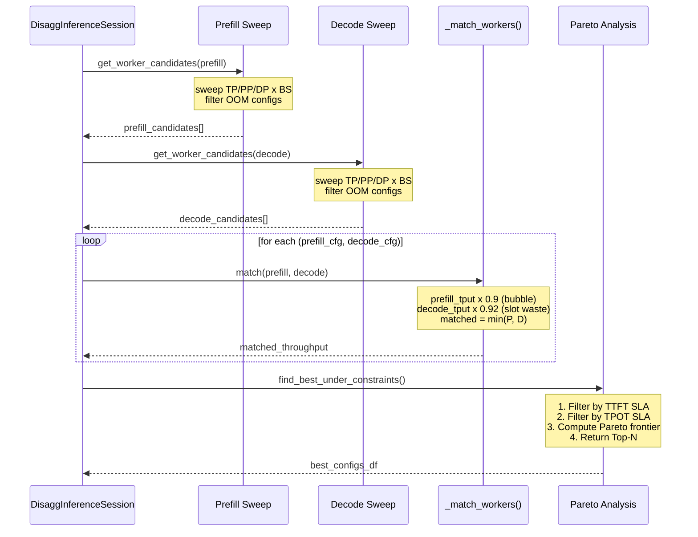
```mermaid
sequenceDiagram
    participant DS as DisaggInferenceSession
    participant PS as Prefill Sweep
    participant DCS as Decode Sweep
    participant MATCH as _match_workers()
    participant PARETO as Pareto Analysis

    DS->>PS: get_worker_candidates(prefill)
    Note over PS: sweep TP/PP/DP x BS<br/>filter OOM configs
    PS-->>DS: prefill_candidates[]

    DS->>DCS: get_worker_candidates(decode)
    Note over DCS: sweep TP/PP/DP x BS<br/>filter OOM configs
    DCS-->>DS: decode_candidates[]

    loop for each (prefill_cfg, decode_cfg)
        DS->>MATCH: match(prefill, decode)
        Note over MATCH: prefill_tput x 0.9 (bubble)<br/>decode_tput x 0.92 (slot waste)<br/>matched = min(P, D)
        MATCH-->>DS: matched_throughput
    end

    DS->>PARETO: find_best_under_constraints()
    Note over PARETO: 1. Filter by TTFT SLA<br/>2. Filter by TPOT SLA<br/>3. Compute Pareto frontier<br/>4. Return Top-N
    PARETO-->>DS: best_configs_df
```

**降级因子**：
- Prefill: **0.9**（pipeline bubble，切换 prefill/decode 时的空闲）
- Decode: **0.92**（率匹配下 batch slot 利用不足）

### 3.7 Pareto 分析与配置选择 (`pareto_analysis.py`, `picking.py`)

**三种选择策略**：

| 策略 | 函数 | 说明 |
|------|------|------|
| **Default** | `pick_default()` | 固定 GPU 预算下，SLA 约束内最大化 tokens/s/gpu |
| **Load Match** | `pick_load_match()` | 给定目标负载，最小化所需 GPU 数 |
| **Autoscale** | `pick_autoscale()` | Prefill/Decode 独立选择（不做率匹配） |

**Pareto 前沿**：2D 非支配点集（throughput vs. latency），确保返回的每个配置在某个维度上不被其他配置严格优于。

#### Pareto 筛选流程

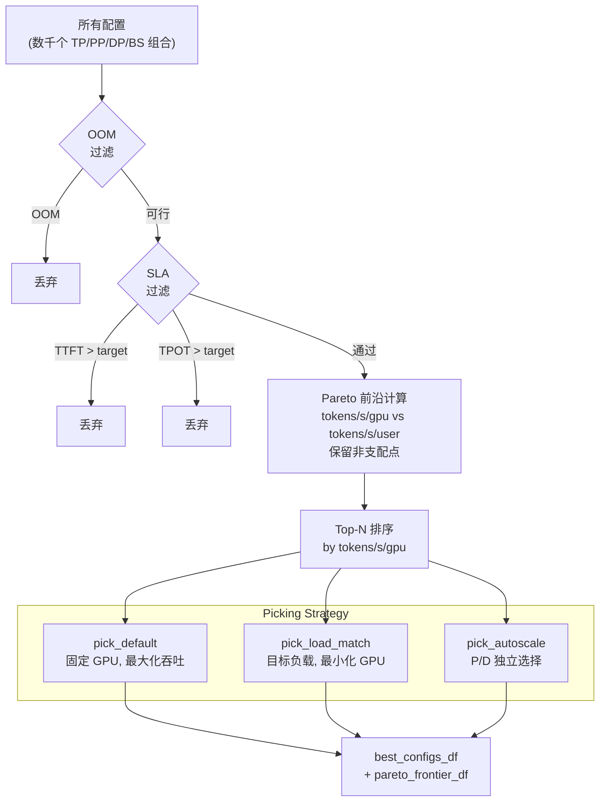
```mermaid
flowchart TD
    ALL["所有配置<br/>(数千个 TP/PP/DP/BS 组合)"]
    
    OOM_F{"OOM<br/>过滤"}
    ALL --> OOM_F
    OOM_F -->|"OOM"| DROP1["丢弃"]
    OOM_F -->|"可行"| SLA_F

    SLA_F{"SLA<br/>过滤"}
    SLA_F -->|"TTFT > target"| DROP2["丢弃"]
    SLA_F -->|"TPOT > target"| DROP3["丢弃"]
    SLA_F -->|"通过"| PARETO_C

    PARETO_C["Pareto 前沿计算<br/>tokens/s/gpu vs tokens/s/user<br/>保留非支配点"]

    PARETO_C --> TOPN["Top-N 排序<br/>by tokens/s/gpu"]
    
    subgraph PICK["Picking Strategy"]
        PD["pick_default<br/>固定 GPU, 最大化吞吐"]
        PL["pick_load_match<br/>目标负载, 最小化 GPU"]
        PA["pick_autoscale<br/>P/D 独立选择"]
    end

    TOPN --> PD & PL & PA
    PD & PL & PA --> RESULT["best_configs_df<br/>+ pareto_frontier_df"]
```

---

## 4. Generator：配置生成管线

SDK 输出最优配置参数后，Generator 将其转化为可直接部署的文件。

### 4.1 六阶段管线


```mermaid
flowchart LR
    subgraph S1["Stage 1<br/>INPUT PARSING"]
        S1A["parse_cli_params()<br/>解析 KEY=VALUE"]
        S1B["load_generator_overrides()<br/>YAML + inline merge"]
    end

    subgraph S2["Stage 2<br/>DEFAULT APPLICATION"]
        S2A["deployment_config.yaml<br/>~54 参数默认值"]
        S2B["backend_defaults<br/>框架特化默认"]
        S2C["Jinja2 表达式求值"]
    end

    subgraph S3["Stage 3<br/>RULE EVALUATION"]
        S3A["rule_plugin/*.rule<br/>自定义 DSL"]
        S3B["计算派生参数:<br/>batch_size, TP,<br/>block alignment"]
    end

    subgraph S4["Stage 4<br/>PARAMETER MAPPING"]
        S4A["backend_config_mapping.yaml"]
        S4B["统一参数名<br/>→ 框架 CLI flag<br/>含值变换(如反转)"]
    end

    subgraph S5["Stage 5<br/>TEMPLATE RENDERING"]
        S5A["版本选择<br/>(floor match)"]
        S5B["per-worker context<br/>(prefill/decode/agg)"]
        S5C["Jinja2 渲染<br/>backend_templates/**/*.j2"]
    end

    subgraph S6["Stage 6<br/>ARTIFACT EMISSION"]
        S6A["k8s_deploy.yaml"]
        S6B["run.sh (per node)"]
        S6C["cli_args"]
        S6D["engine_config.yaml"]
    end

    S1 --> S2 --> S3 --> S4 --> S5 --> S6
```

#### Generator 执行时序图

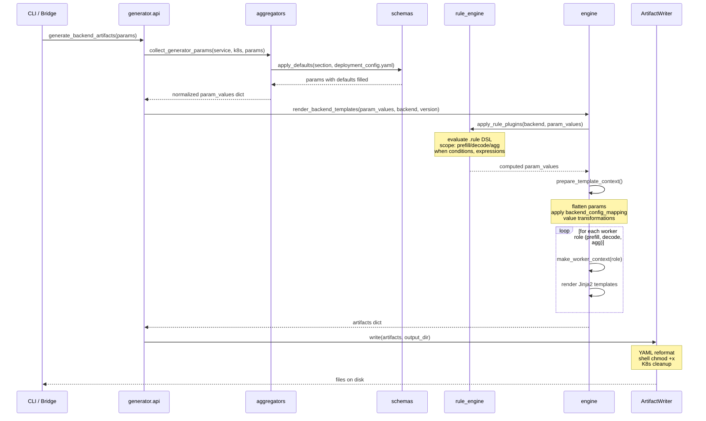
```mermaid
sequenceDiagram
    participant CLI as CLI / Bridge
    participant API as generator.api
    participant AGG as aggregators
    participant SCH as schemas
    participant RE as rule_engine
    participant ENG as engine
    participant AW as ArtifactWriter

    CLI->>API: generate_backend_artifacts(params)
    API->>AGG: collect_generator_params(service, k8s, params)
    AGG->>SCH: apply_defaults(section, deployment_config.yaml)
    SCH-->>AGG: params with defaults filled
    AGG-->>API: normalized param_values dict
    
    API->>ENG: render_backend_templates(param_values, backend, version)
    ENG->>RE: apply_rule_plugins(backend, param_values)
    Note over RE: evaluate .rule DSL<br/>scope: prefill/decode/agg<br/>when conditions, expressions
    RE-->>ENG: computed param_values
    
    ENG->>ENG: prepare_template_context()
    Note over ENG: flatten params<br/>apply backend_config_mapping<br/>value transformations
    
    loop for each worker role (prefill, decode, agg)
        ENG->>ENG: make_worker_context(role)
        ENG->>ENG: render Jinja2 templates
    end
    
    ENG-->>API: artifacts dict
    API->>AW: write(artifacts, output_dir)
    Note over AW: YAML reformat<br/>shell chmod +x<br/>K8s cleanup
    AW-->>CLI: files on disk
```

### 4.2 Rule DSL 语法

```python
# 作用域前缀
prefill <key> = <expr>              # 仅 prefill worker
decode <key> = <expr>               # 仅 decode worker
agg <key> = <expr>                  # 仅聚合模式 worker
agg_decode <key> = <expr>           # agg + decode
agg_prefill_decode <key> = <expr>   # 所有 role

# 条件块
when ModelConfig.is_moe and (moe_tensor_parallel_size and moe_expert_parallel_size):
    agg_prefill_decode tensor_parallel_size = moe_tensor_parallel_size * moe_expert_parallel_size

# 全局配置
DynConfig.enable_router = true

# Block 对齐（TRT-LLM 要求 max_num_tokens % tokens_per_block == 0）
agg max_num_tokens = ((max_batch_size + SlaConfig.isl + 500 + tokens_per_block - 1) // tokens_per_block) * tokens_per_block
```

### 4.3 版本模板选择

```
backend_templates/
  trtllm/
    extra_engine_args.yaml.j2           # 基础版本
    extra_engine_args.1.0.0rc3.yaml.j2  # 1.0.0rc3+ 特化
    extra_engine_args.1.2.0rc5.yaml.j2  # 1.2.0rc5+ 特化
    extra_engine_args.1.3.0rc11.yaml.j2 # 最新版本
  sglang/
    cli_args.j2                         # 基础
    cli_args.0.5.6.post2.j2            # 0.5.6.post2+ (nixl kv transfer)
    cli_args.0.5.10.post1.j2           # 最新
```

选择逻辑：**floor match**（最高的 version ≤ 请求版本）。仅当 CLI 接口变更时才创建新版本模板。

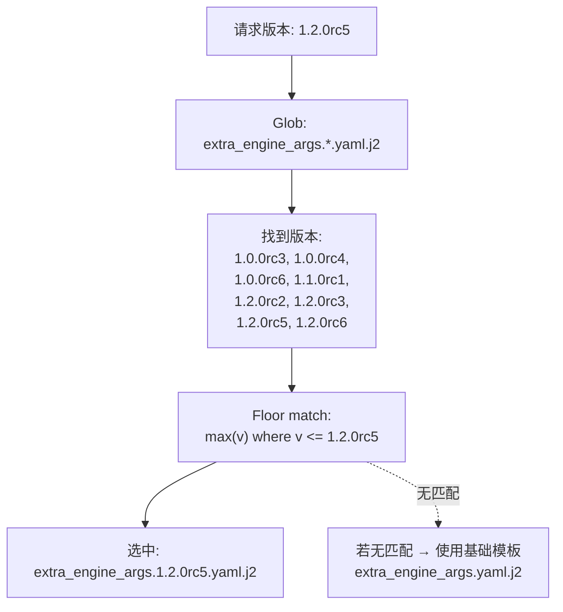
```mermaid
flowchart TD
    REQ["请求版本: 1.2.0rc5"]
    
    GLOB["Glob: extra_engine_args.*.yaml.j2"]
    VERSIONS["找到版本:<br/>1.0.0rc3, 1.0.0rc4,<br/>1.0.0rc6, 1.1.0rc1,<br/>1.2.0rc2, 1.2.0rc3,<br/>1.2.0rc5, 1.2.0rc6"]
    
    FLOOR["Floor match:<br/>max(v) where v <= 1.2.0rc5"]
    SELECT["选中: extra_engine_args.1.2.0rc5.yaml.j2"]
    
    FALLBACK["若无匹配 → 使用基础模板<br/>extra_engine_args.yaml.j2"]

    REQ --> GLOB --> VERSIONS --> FLOOR --> SELECT
    FLOOR -.->|"无匹配"| FALLBACK
```

### 4.4 关键 Guard Rails（从 ~60 个 PR 提炼）

| Guard | 严重性 | 说明 |
|-------|--------|------|
| `max_num_tokens % tokens_per_block == 0` | **CRASH** | TRT-LLM 断言 block 对齐 |
| MoE: `TP = moe_tp * moe_ep` | **OOM** | 否则模型在每 GPU 上全量复制 |
| Prefill: `disable_overlap_scheduler = true` | **CRASH** | Overlap scheduler 在 prefill 导致 hang |
| SGLang: 不能发出 `--moe-dense-tp-size` | **CRASH** | 仅接受值 1 或 None |
| vLLM: `--cudagraph-capture-sizes` 用空格分隔 | **CRASH** | 逗号会被当作值的一部分 |
| KV cache dtype `"float16"` → `"auto"` | **CRASH** | 三个框架都不接受字面量 "float16" |

---

## 5. Data Layer：硬件定义与性能数据

### 5.1 系统定义 (`systems/*.yaml`)

每个 GPU 型号一个 YAML 文件：

```yaml
# h200_sxm.yaml
gpu:
  mem_bw: 4800        # GB/s 显存带宽
  mem: 151             # GB HBM 容量
  float16_tc_flops: 989  # TFLOPS
  fp8_tc_flops: 1979
  fp4_tc_flops: 3958
  power: 700           # Watts TDP
  sm_version: 90
  mem_bw_empirical_scaling_factor: 0.8  # 实测带宽折扣
node:
  num_gpus_per_node: 8
  intra_node_bw: 450   # GB/s (NVLink)
  inter_node_bw: 100   # GB/s (跨节点)
  p2p_latency: 10      # µs
```

### 5.2 性能数据格式

```
systems/data/{system}/{backend}/{version}/
  ├── gemm_perf.txt              # GEMM 操作延迟 (M, N, K, quant → latency)
  ├── moe_perf.txt               # MoE 操作延迟
  ├── context_attention_perf.txt  # Prefill Attention
  ├── generation_attention_perf.txt # Decode Attention
  ├── context_mla_perf.txt        # MLA (DeepSeek)
  ├── custom_allreduce_perf.txt   # AllReduce 通信
  ├── mla_bmm_perf.txt            # MLA BMM
  └── ...
```

数据为空格分隔 CSV，Git LFS 管理（单文件可达 6MB+）。

#### Data Layer 组件图

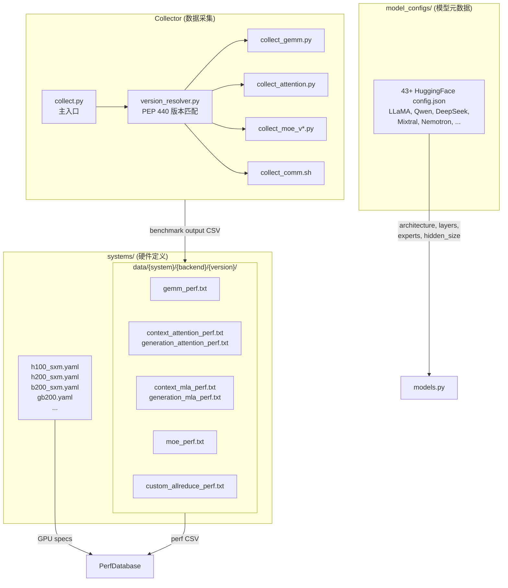
```mermaid
graph TB
    subgraph COLLECTOR["Collector (数据采集)"]
        CC["collect.py<br/>主入口"]
        CG["collect_gemm.py"]
        CA["collect_attention.py"]
        CM["collect_moe_v*.py"]
        CS["collect_comm.sh"]
        VR["version_resolver.py<br/>PEP 440 版本匹配"]
        
        CC --> VR
        VR --> CG & CA & CM & CS
    end

    subgraph SYSTEMS["systems/ (硬件定义)"]
        SYS_YAML["h100_sxm.yaml<br/>h200_sxm.yaml<br/>b200_sxm.yaml<br/>gb200.yaml<br/>..."]
        
        subgraph DATA["data/{system}/{backend}/{version}/"]
            GEMM["gemm_perf.txt"]
            ATTN["context_attention_perf.txt<br/>generation_attention_perf.txt"]
            MLA["context_mla_perf.txt<br/>generation_mla_perf.txt"]
            MOE_D["moe_perf.txt"]
            COMM["custom_allreduce_perf.txt"]
        end
    end

    subgraph MODEL_CFG["model_configs/ (模型元数据)"]
        HF["43+ HuggingFace config.json<br/>LLaMA, Qwen, DeepSeek,<br/>Mixtral, Nemotron, ..."]
    end

    COLLECTOR -->|"benchmark output CSV"| DATA
    SYS_YAML -->|"GPU specs"| PERFDB["PerfDatabase"]
    DATA -->|"perf CSV"| PERFDB
    HF -->|"architecture, layers,<br/>experts, hidden_size"| MODELS["models.py"]
```

### 5.3 数据采集器 (`collector/`)

**采集流程**：
```bash
# 冒烟测试
python3 collect.py --backend trtllm --smoke

# 完整采集（~30 GPU-hours, 8-GPU 上 3-4 小时）
python3 collect.py --backend trtllm

# 带功耗监控
python3 collect.py --backend trtllm --measure_power --power_test_duration_sec 2.0

# 断点续传
python3 collect.py --backend trtllm --resume --checkpoint-dir /path
```

**版本管理**：每个采集器声明 `__compat__ = "<backend>>=X.Y.Z"`（PEP 440），运行时自动选择匹配版本。

### 5.4 模型配置 (`model_configs/`)

43+ 个 HuggingFace `config.json` 文件。AIC 从中提取：

- `num_hidden_layers`, `hidden_size`：模型维度
- `num_attention_heads`, `num_key_value_heads`：注意力配置
- `num_experts`, `num_experts_per_tok`：MoE 配置
- `intermediate_size`：FFN 维度
- `max_position_embeddings`：上下文长度
- `torch_dtype`：数据类型推断

---

## 6. CLI 操作模式

### 6.1 五种模式

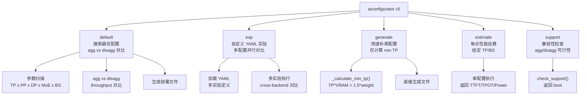
```mermaid
flowchart TD
    CLI_ENTRY["aiconfigurator cli"]
    
    CLI_ENTRY --> DEFAULT["default<br/>搜索最优配置<br/>agg vs disagg 对比"]
    CLI_ENTRY --> EXP["exp<br/>自定义 YAML 实验<br/>多配置并行对比"]
    CLI_ENTRY --> GENERATE["generate<br/>快速朴素配置<br/>仅计算 min TP"]
    CLI_ENTRY --> ESTIMATE["estimate<br/>单点性能估算<br/>给定 TP/BS"]
    CLI_ENTRY --> SUPPORT["support<br/>兼容性检查<br/>agg/disagg 可行性"]
    
    DEFAULT --> SWEEP["参数扫描<br/>TP x PP x DP x MoE x BS"]
    DEFAULT --> COMPARE["agg vs disagg<br/>throughput 对比"]
    DEFAULT --> GEN_OUT["生成部署文件"]
    
    EXP --> YAML_IN["加载 YAML<br/>多实验定义"]
    EXP --> MULTI["多实验执行<br/>cross-backend 对比"]
    
    GENERATE --> NAIVE["_calculate_min_tp()<br/>TP*VRAM > 1.5*weight"]
    GENERATE --> GEN_OUT2["直接生成文件"]
    
    ESTIMATE --> SINGLE["单配置执行<br/>返回 TTFT/TPOT/Power"]
    
    SUPPORT --> CHECK["check_support()<br/>返回 bool"]
```

| 模式 | 用途 | 命令示例 |
|------|------|----------|
| **default** | 搜索最优配置（agg vs disagg 对比） | `aiconfigurator cli default --model Qwen/Qwen3-32B-FP8 --total-gpus 32 --system h200_sxm` |
| **exp** | 自定义实验（YAML 定义） | `aiconfigurator cli exp --yaml-path custom.yaml` |
| **generate** | 快速生成朴素配置（无搜索） | `aiconfigurator cli generate --model-path ... --total-gpus 8 --system h200_sxm` |
| **estimate** | 单点性能估算 | `aiconfigurator cli estimate --model-path ... --tp-size 2 --batch-size 64` |
| **support** | 检查模型/硬件/框架兼容性 | `aiconfigurator cli support --model-path ... --system h200_sxm` |

### 6.2 Python API

```python
from aiconfigurator.cli import cli_default, cli_exp, cli_generate, cli_support

# 搜索最优配置
result = cli_default(
    model_path="Qwen/Qwen3-32B-FP8",
    total_gpus=32,
    system="h200_sxm",
    ttft=300,   # ms
    tpot=10,    # ms
    isl=4000,
    osl=500
)
print(result.best_configs["disagg"].head())

# 检查支持
agg_ok, disagg_ok = cli_support(model_path="Qwen/Qwen3-32B-FP8", system="h200_sxm")
```

### 6.3 默认参数

| 参数 | 默认值 | 说明 |
|------|--------|------|
| ISL | 4000 | Input Sequence Length |
| OSL | 1000 | Output Sequence Length |
| TTFT | 2000 ms | Time to First Token SLA |
| TPOT | 30 ms | Time per Output Token SLA |
| database_mode | SILICON | 使用实测数据 |
| backend | trtllm | 推理框架 |

---

## 7. End-to-End 数据流

### 7.1 完整执行流程

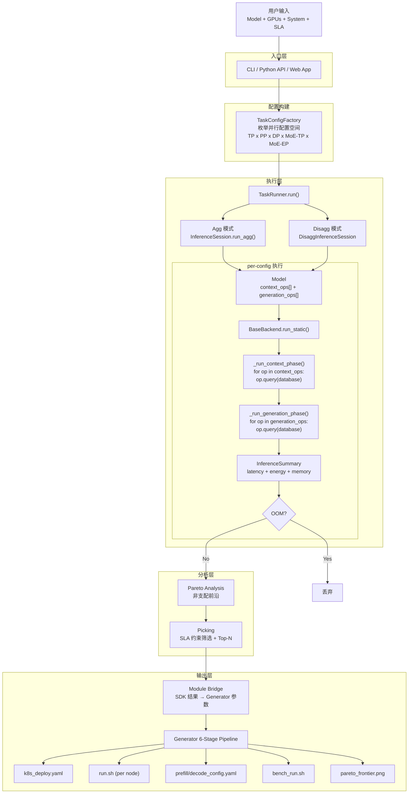
```mermaid
flowchart TD
    USER["用户输入<br/>Model + GPUs + System + SLA"]
    
    subgraph ENTRY["入口层"]
        CLI["CLI / Python API / Web App"]
    end
    
    subgraph CONFIG["配置构建"]
        TCF["TaskConfigFactory<br/>枚举并行配置空间<br/>TP x PP x DP x MoE-TP x MoE-EP"]
    end
    
    subgraph EXEC["执行层"]
        RUNNER["TaskRunner.run()"]
        
        AGG_PATH["Agg 模式<br/>InferenceSession.run_agg()"]
        DISAGG_PATH["Disagg 模式<br/>DisaggInferenceSession"]
        
        subgraph SWEEP["per-config 执行"]
            MODEL_OPS["Model<br/>context_ops[] + generation_ops[]"]
            STATIC["BaseBackend.run_static()"]
            CTX_PHASE["_run_context_phase()<br/>for op in context_ops:<br/>  op.query(database)"]
            GEN_PHASE["_run_generation_phase()<br/>for op in generation_ops:<br/>  op.query(database)"]
            SUMMARY["InferenceSummary<br/>latency + energy + memory"]
            OOM{"OOM?"}
        end
    end

    subgraph ANALYSIS["分析层"]
        PARETO["Pareto Analysis<br/>非支配前沿"]
        PICK["Picking<br/>SLA 约束筛选 + Top-N"]
    end

    subgraph OUTPUT["输出层"]
        BRIDGE["Module Bridge<br/>SDK 结果 → Generator 参数"]
        GEN_PIPE["Generator 6-Stage Pipeline"]
        
        K8S["k8s_deploy.yaml"]
        RUNSH["run.sh (per node)"]
        CFGS["prefill/decode_config.yaml"]
        BENCH["bench_run.sh"]
        PNG["pareto_frontier.png"]
    end

    USER --> CLI --> TCF --> RUNNER
    RUNNER --> AGG_PATH & DISAGG_PATH
    AGG_PATH & DISAGG_PATH --> MODEL_OPS --> STATIC
    STATIC --> CTX_PHASE --> GEN_PHASE --> SUMMARY --> OOM
    OOM -->|"Yes"| DISCARD["丢弃"]
    OOM -->|"No"| PARETO --> PICK --> BRIDGE --> GEN_PIPE
    GEN_PIPE --> K8S & RUNSH & CFGS & BENCH & PNG
```

### 7.2 `default` 模式完整时序

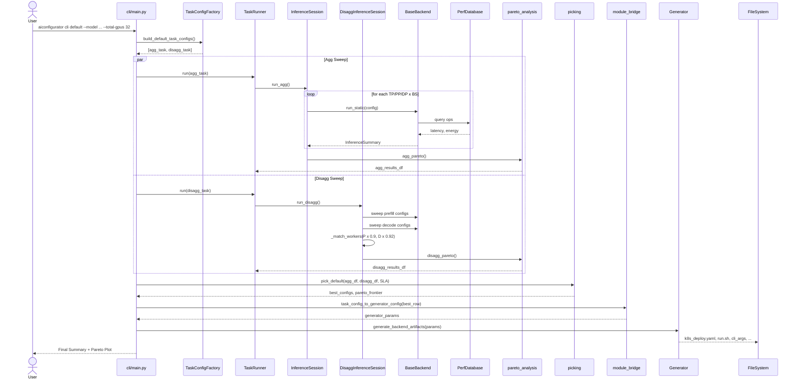
```mermaid
sequenceDiagram
    actor User
    participant CLI as cli/main.py
    participant TCF as TaskConfigFactory
    participant TR as TaskRunner
    participant IS as InferenceSession
    participant DIS as DisaggInferenceSession
    participant BE as BaseBackend
    participant DB as PerfDatabase
    participant PA as pareto_analysis
    participant PK as picking
    participant BR as module_bridge
    participant GEN as Generator
    participant FS as FileSystem

    User->>CLI: aiconfigurator cli default --model ... --total-gpus 32
    CLI->>TCF: build_default_task_configs()
    TCF-->>CLI: [agg_task, disagg_task]

    par Agg Sweep
        CLI->>TR: run(agg_task)
        TR->>IS: run_agg()
        loop for each TP/PP/DP x BS
            IS->>BE: run_static(config)
            BE->>DB: query ops
            DB-->>BE: latency, energy
            BE-->>IS: InferenceSummary
        end
        IS->>PA: agg_pareto()
        PA-->>TR: agg_results_df
    and Disagg Sweep
        CLI->>TR: run(disagg_task)
        TR->>DIS: run_disagg()
        DIS->>BE: sweep prefill configs
        DIS->>BE: sweep decode configs
        DIS->>DIS: _match_workers(P x 0.9, D x 0.92)
        DIS->>PA: disagg_pareto()
        PA-->>TR: disagg_results_df
    end

    CLI->>PK: pick_default(agg_df, disagg_df, SLA)
    PK-->>CLI: best_configs, pareto_frontier

    CLI->>BR: task_config_to_generator_config(best_row)
    BR-->>CLI: generator_params
    CLI->>GEN: generate_backend_artifacts(params)
    GEN-->>FS: k8s_deploy.yaml, run.sh, cli_args, ...
    
    CLI-->>User: Final Summary + Pareto Plot
```

---

## 8. 扩展 AIC 支持 AFD 的思路

基于 `AFD_Prototype_Discussion.pdf` 邮件中的方向——**扩展 AIC 的 kernel decomposition 框架支持 AFD 性能仿真**：

### 8.1 当前 AIC 的 Disagg 建模

AIC 当前仅支持 **PD 分离**（Prefill-Decode Disaggregation）：
- Prefill worker：context_ops 全在一个 GPU pool
- Decode worker：generation_ops 全在另一个 GPU pool
- KV Cache 传输通过率匹配建模（降级因子 0.9 / 0.92）

#### 现有 PD Disagg vs. 未来 AFD 对比

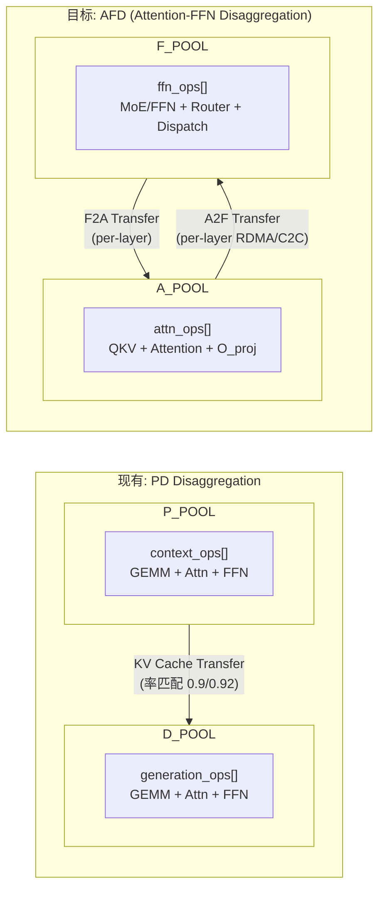
```mermaid
graph LR
    subgraph PD["现有: PD Disaggregation"]
        direction TB
        P_POOL["Prefill GPU Pool"]
        D_POOL["Decode GPU Pool"]
        P_POOL -->|"KV Cache Transfer<br/>(率匹配 0.9/0.92)"| D_POOL
        
        subgraph P_POOL
            P_CTX["context_ops[]<br/>GEMM + Attn + FFN"]
        end
        subgraph D_POOL
            D_GEN["generation_ops[]<br/>GEMM + Attn + FFN"]
        end
    end

    subgraph AFD["目标: AFD (Attention-FFN Disaggregation)"]
        direction TB
        A_POOL["Attention Pool<br/>(GPU / Vera Rubin)"]
        F_POOL["FFN Pool<br/>(GPU / LPU)"]
        
        A_POOL -->|"A2F Transfer<br/>(per-layer RDMA/C2C)"| F_POOL
        F_POOL -->|"F2A Transfer<br/>(per-layer)"| A_POOL

        subgraph A_POOL
            A_OPS["attn_ops[]<br/>QKV + Attention + O_proj"]
        end
        subgraph F_POOL
            F_OPS["ffn_ops[]<br/>MoE/FFN + Router + Dispatch"]
        end
    end
```

### 8.2 AFD 扩展需要什么

**新增操作类型**：
- `A2F_Transfer`: Attention → FFN hidden state 传输（每层 per-layer RDMA/C2C）
- `F2A_Transfer`: FFN → Attention 返回传输
- `MicroBatchOverlap`: 3BO 流水线 bubble 建模

**新增模型分解模式**：
- 现有: `context_ops[]` + `generation_ops[]`（全部在同一 worker）
- AFD 需要: `attn_ops[]` + `ffn_ops[]` + `transfer_ops[]`（跨两个 worker pool）

**新增搜索维度**：
- A:F GPU ratio（1:1, 2:1, 3:2, 4:2, ...）
- Micro-batch 数量 m（1, 2, 3, 4）
- 通信后端（RDMA / C2C / StepMesh）

**新增硬件定义**：
- LPU 规格（SRAM 容量、SRAM 带宽、FP8 算力、C2C 带宽）
- GPU-LPU 互联拓扑（SPX, FPGA aggregation latency）

### 8.3 AFD 率匹配公式

参考 arXiv:2601.21351 的理论框架：

$$\tau(B; r) = \max\{t_A(T),\ t_C(B),\ t_F(rB)\}$$

$$r^* = \max\left\{\frac{\alpha_A \bar{T} + \beta_A - \beta_F}{\alpha_F B},\quad \frac{\bar{t}_C - \beta_F}{\alpha_F B},\quad \sqrt{\frac{\beta_F}{\alpha_F B}}\right\}$$

AIC 的操作分解框架天然适合计算 $t_A$, $t_F$, $t_C$——只需将现有的 Attention ops 和 FFN ops 路由到不同硬件的性能数据库查询。

### 8.4 建议实现路径

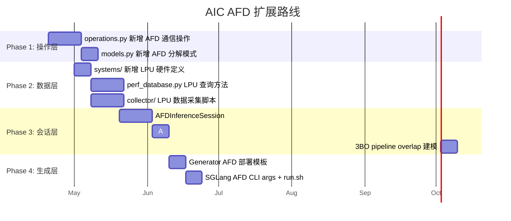
```mermaid
gantt
    title AIC AFD 扩展路线
    dateFormat  YYYY-MM-DD
    axisFormat  %b

    section Phase 1: 操作层
    operations.py 新增 AFD 通信操作   :a1, 2026-04-20, 14d
    models.py 新增 AFD 分解模式       :a2, after a1, 7d

    section Phase 2: 数据层
    systems/ 新增 LPU 硬件定义        :b1, 2026-05-01, 7d
    perf_database.py LPU 查询方法     :b2, after b1, 14d
    collector/ LPU 数据采集脚本       :b3, after b1, 14d

    section Phase 3: 会话层
    AFDInferenceSession               :c1, 2026-05-20, 14d
    A:F 率匹配 + micro-batch bubble   :c2, after c1, 7d
    3BO pipeline overlap 建模         :c3, after c2, 7d

    section Phase 4: 生成层
    Generator AFD 部署模板            :d1, 2026-06-10, 7d
    SGLang AFD CLI args + run.sh      :d2, after d1, 7d
```

#### AFD 推理仿真时序图（目标设计）

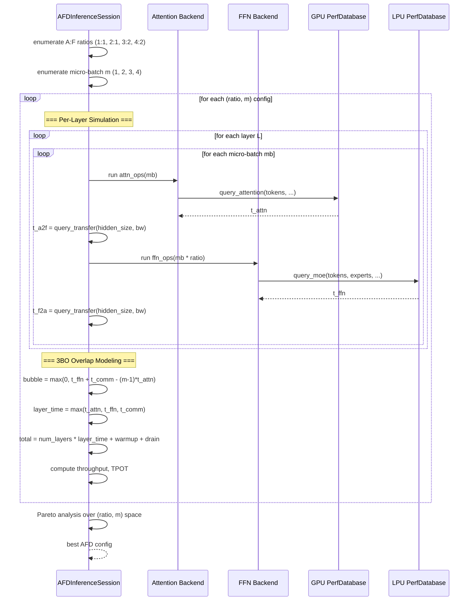
```mermaid
sequenceDiagram
    participant AIC as AFDInferenceSession
    participant A_BE as Attention Backend
    participant F_BE as FFN Backend
    participant A_DB as GPU PerfDatabase
    participant F_DB as LPU PerfDatabase

    AIC->>AIC: enumerate A:F ratios (1:1, 2:1, 3:2, 4:2)
    AIC->>AIC: enumerate micro-batch m (1, 2, 3, 4)

    loop for each (ratio, m) config
        Note over AIC: === Per-Layer Simulation ===
        loop for each layer L
            loop for each micro-batch mb
                AIC->>A_BE: run attn_ops(mb)
                A_BE->>A_DB: query_attention(tokens, ...)
                A_DB-->>A_BE: t_attn
                
                AIC->>AIC: t_a2f = query_transfer(hidden_size, bw)
                
                AIC->>F_BE: run ffn_ops(mb * ratio)
                F_BE->>F_DB: query_moe(tokens, experts, ...)
                F_DB-->>F_BE: t_ffn
                
                AIC->>AIC: t_f2a = query_transfer(hidden_size, bw)
            end
        end
        
        Note over AIC: === 3BO Overlap Modeling ===
        AIC->>AIC: bubble = max(0, t_ffn + t_comm - (m-1)*t_attn)
        AIC->>AIC: layer_time = max(t_attn, t_ffn, t_comm)
        AIC->>AIC: total = num_layers * layer_time + warmup + drain
        
        AIC->>AIC: compute throughput, TPOT
    end

    AIC->>AIC: Pareto analysis over (ratio, m) space
    AIC-->>AIC: best AFD config
```

---

## 9. 关键设计模式总结

| 模式 | 体现位置 | 说明 |
|------|----------|------|
| **操作组合** | `operations.py` → `models.py` | 将推理分解为原子操作，模型定义操作序列 |
| **分层配置** | `task.py` TaskConfigFactory | base → mode → profile → yaml 层级合并 |
| **数据库抽象** | `perf_database.py` | 操作查询不关心数据存储格式 |
| **阶段执行** | `base_backend.py` | Context/Generation 独立处理，支持 disagg worker pairing |
| **率匹配** | `inference_session.py` | 用降级因子平衡 prefill/decode 吞吐 |
| **版本隔离** | Generator templates | 每个框架版本独立模板，floor match 选择 |
| **6-Stage Pipeline** | Generator | Input → Defaults → Rules → Mapping → Templates → Artifacts |
| **Pareto 优化** | `pareto_analysis.py` | 非支配前沿 + SLA 约束筛选 |
