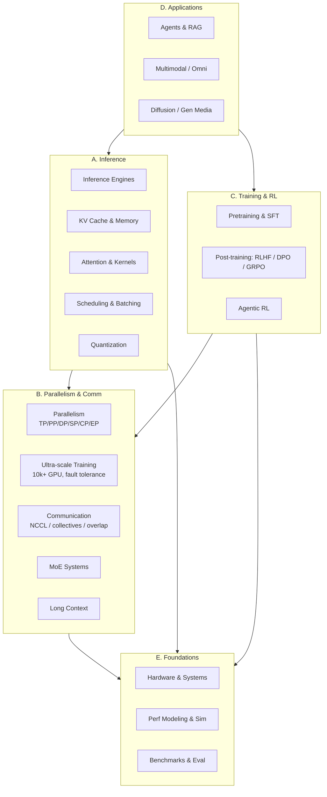

# AI Infra Roadmap

Full stack, grouped into 5 clusters. Every box is a topic page you can click into.

## Cluster A — Inference

The runtime path from request to tokens.

- [Inference Engines](engines/index.md) — vLLM, SGLang, TensorRT-LLM, LMDeploy, TGI, Mooncake
- [KV Cache & Memory](kv-cache/index.md) — PagedAttn, RadixAttn, tiered KV, disagg, compression
- [Attention & Kernels](attention/index.md) — FlashAttn v1-3, FlashInfer, FlashMLA, CUTLASS, Triton
- [Scheduling & Batching](scheduling/index.md) — continuous batching, chunked prefill, spec decode, P-D disagg
- [Quantization & Compression](quantization/index.md) — FP8/FP4, AWQ, GPTQ, SmoothQuant, SpinQuant, sparsity

## Cluster B — Parallelism & Communication

How compute gets split and how devices talk.

- [Parallelism](parallelism/index.md) — TP, PP, DP, SP, CP, EP; **AFD** (Attention-FFN Disagg)
- [Ultra-scale Training](large-scale/index.md) — 10k+ GPU runs, fault tolerance, elastic training, straggler / slow-node handling, checkpoint resharding
- [Communication & Networking](communication/index.md) — NCCL, MSCCL, collective algorithms, NVLink / NVSwitch / IB / RoCE, compute-comm overlap, topology-aware placement
- [MoE Systems](moe/index.md) — routing, expert parallelism, DeepEP, load balancing, skew handling
- [Long Context](long-context/index.md) — Ring Attention, context parallelism, Infini-attention, sparse / linear attention, 1M+ token serving

## Cluster C — Training & RL

- [Pretraining & SFT](training/index.md) — FSDP, ZeRO, Megatron, checkpointing, data pipelines
- [Post-training (RLHF/DPO/GRPO)](post-training/index.md) — reward models, PPO, DPO, GRPO, reward hacking
- [Agentic RL](agentic-rl/index.md) — verl, rStar, tool-use RL, long-horizon credit assignment, environment design

## Cluster D — Applications

Where infra gets used.

- [Agents & RAG](agents/index.md) — planning, memory, tool use, multi-agent, eval
- [Multimodal & Omni](multimodal/index.md) — VLM serving, omni (any-to-any), audio, video understanding
- [Diffusion & Gen Media](diffusion/index.md) — image / video gen serving, DiT, step distillation, caching

## Cluster E — Foundations

- [Hardware & Systems](hardware/index.md) — H100/H200/B200/GB200, NVLink/IB, CUDA, NCCL
- [Perf Modeling & Simulation](perf-modeling/index.md) — analytical simulators, roofline, AIConfigurator-style tools
- [Benchmarks & Evaluation](benchmarks/index.md) — MLPerf, long-context eval, agent benchmarks

---

## My current focus (2026)

- **AFD (Attention-FFN Disaggregation)** — when it wins, how to size the ratio
- **FlexKV / elastic KV management** — tiered KV, offload, disagg
- **Perf modeling** — analytical simulators for serving systems
- **MoE serving at scale** — EP + DeepEP + skew
